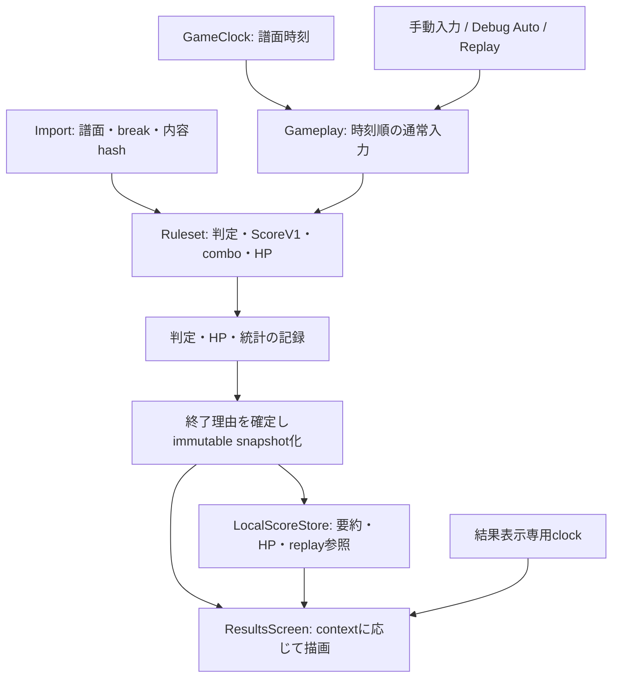

# stable結果画面に不足するデータと機能の実装計画

2026-09-29。[結果画面の解析](results-stable-research-20260929.md)と[画面再現計画](results-stable-plan-20260929.md)を補完する。
Javaの確認基準は`d1bf8cbbb5d42e13697c60f20c6b69d4edc97c7d`。本書は**未実装の計画**であり、製品コードは変更していない。
対象は指定stable buildのosu!standard・オフライン結果。まずNoModの実プレイから結果表示までを成立させ、その後にreplay・Mod条件を増やす。
[追加解析](results-stable-followup-20260929.md)で確認したHP・UR・spinner・Perfectの契約を以下へ反映した。静的に確定した算術と、実機比較を要する入力順序・描画を区別する。

## 1. 追加監査で確認した不足

結果用recordにfieldを追加するだけでは、正しい値を生成できない。次の生成元を先に整える必要がある。

| 現行実装・根拠 | 不足・結果画面への影響 | 対応単位 |
| --- | --- | --- |
| [BeatmapFileParser](../core/src/main/java/dev/osujava/beatmap/parse/BeatmapFileParser.java)はEventsから背景だけを取り出す | break区間が失われ、HP drain停止・ScoreV1のdrain lengthを計算できない。AudioLeadInも保持しない | P1 |
| [BeatmapDifficulty](../core/src/main/java/dev/osujava/beatmap/BeatmapDifficulty.java)のsettingsにはHP / CS / ODがある | 設定値は利用可能。break、開始条件、内容hashは追加が必要。Import全体の置換は不要 | P1 |
| [GameplaySession](../core/src/main/java/dev/osujava/gameplay/GameplaySession.java)の入力に時刻がない | session内部のclock読取り時刻で判定する。同時刻の順序、replayでの再実行条件が未定義 | P2 |
| [GameplayInputProcessor](../core/src/main/java/dev/osujava/ui/GameplayInputProcessor.java)は物理入力をLEFT / RIGHTへ集約 | 集約後だけでは`.osr`用のマウス／キーボード区別を復元できない。PointerStateのpressedもboolean一つ | P2、P10 |
| [GameplayScreen](../core/src/main/java/dev/osujava/ui/GameplayScreen.java)は`clock.finished()`で結果確定 | 音源ありではEOFが終了条件。短い音源で未処理objectをfinishし、長い音源では全判定後も待つ | P2、P8 |
| [MusicGameClock](../core/src/main/java/dev/osujava/gameplay/MusicGameClock.java)はEOF後の時刻を進めない | 後続object・判定窓を自然に処理できない。結果表示用の時計とも分離が必要 | P2 |
| [ScoreTracker](../core/src/main/java/dev/osujava/gameplay/ScoreTracker.java)は判定値の単純加算 | combo / difficulty / mod multiplierがない。今のscoreを表示してもScoreV1一致にはならない | P3 |
| [OsuGameplaySession](../core/src/main/java/dev/osujava/ruleset/osu/OsuGameplaySession.java)はslider headをaccuracy countへ加算 | slider全体判定がない。tail失敗も共通nested処理でcomboを0にする | P3 |
| [OsuScoreEvent](../core/src/main/java/dev/osujava/ruleset/osu/OsuScoreEvent.java)はlazer由来の基本点を明記 | tick30、tail150、spinner10 / 50等。stable ScoreV1とは別契約 | P3、P4 |
| spinner判定はprogressの1 / 0.9 / 0.75境界 | 追加解析の半回転境界・bonus条件・速度平滑化へ合わせる必要がある。点数だけ変更しても足りない | P4 |
| `comboInformation()`は表示用番号・色だけを作る | combo set単位の判定集約、Geki / Katu、Perfect用の最大可能comboがない | P5 |
| HP処理・fail状態がない。`GameplayState.completed`は`allJudged()` | 完走とpassは別。grade F、HP graphの情報源がない | P6 |
| circle候補の誤差は絶対値。spinner RPMは短い履歴からのHUD値 | signed hit error列・結果用spinner標本がない。URや結果tooltipへ代用できない | P7 |
| [LocalScoreStore](../core/src/main/java/dev/osujava/score/LocalScoreStore.java)はschema 1 | score・4判定・combo・accuracy・日時・identityを保存。HP等の未収集値を旧データから復元することはできない | P9 |
| [DifficultyIdentity](../core/src/main/java/dev/osujava/score/DifficultyIdentity.java)はsetId＋path | 同じpathの譜面を編集しても区別できない。replayには内容一致確認が必要 | P1、P9 |
| [SongSelectToolboxState](../core/src/main/java/dev/osujava/ui/SongSelectToolboxState.java)は通常Modを有効化しない | 実プレイのMod情報を新しく渡す基盤が必要。アイコンだけ追加して実装済みにしない | P11 |

ここで挙げた現行値はコードで確認した事実。stable互換へ変更する際は計算方式の切替を明示し、過去のosujavaスコアを新方式で黙って再計算しない。

## 2. 生成・収集・表示の責務

命名は案。大規模なevent busや汎用simulation frameworkは作らず、既存sessionに小さな型と呼出点を追加する。

| 契約 | 所有者・内容 | 禁止する代用 |
| --- | --- | --- |
| `PlayContext` | Gameplay開始時のplayId、譜面内容hash、ruleset / scoring version、実効mods、runMode、ローカル表示名 | 終了時の現在設定を読み直して別の条件を付ける |
| 時刻付き入力 | GameClockの譜面時刻、同時刻sequence、座標、物理button状態と論理action | render frame番号、wall clock日時、replayから判定値を直接注入 |
| object結果 | Rulesetが一度だけ確定するtop-level判定、nested hit / break、combo set variant | Rendererからcount・comboを更新 |
| `GameplayOutcome` | running / completed / failed / aborted、終了譜面時刻、確定したpass | 音源EOFをpassとみなす、Esc離脱をMISS列で完走扱い |
| `ResultsSnapshot` | 要約、表示metadata、終了理由、HP列、利用可能な統計・replay。終了時に固定 | 可変sessionや音源への参照を結果画面へ保持 |
| `ResultsEntryContext` | 直後 / 保存結果閲覧 / replay終了 / Debug Autoと、可能操作 | 「データがある」だけでstableには出ない操作・tooltipを表示 |

`ScoreState`はプレイ中HUD向けの小さい値として扱い、毎frameそこへHP全列・replay全列をコピーしない。
不足値は`unknown`、採取した空列、対応外、破損を区別できる小さい型で表す。旧Geki=0、旧Perfect=false、旧pass=trueとは決めない。
HP列・統計は終了時に防御的コピーし、保存処理が間引き・解放しても表示中のsnapshotを変えない。

## 3. 実装単位と検証

### P0: 仕様を確定するfixtureと観測ゲート

既存計画の[段階0](results-stable-plan-20260929.md#段階0-観測条件と未確定分岐を閉じる)を継続する。
自作の最小譜面・同じ許諾済みskin・入力列を用い、入力時刻、判定、score増分、combo、HP、結果遷移を一緒に記録する。
比較資料にはstable hash、譜面bytesのhash、条件、採取方法と未観測欄を付ける。Javaだけの期待値をstable観測値として登録しない。

追加解析ではstandard factoryから呼出経路を確認し、HP係数算出`06003a90`、Geki / Katuのvariant付与`0600068d`、通常入力`060021fb`、spinner `06000837–083d`を追跡した。
残る追跡対象はHP初期充填・drain／failのframe内順序、nested失敗時のHP graph参照object、特殊Mod・replay入力dispatch。結果画面のfont・easing・hitboxも実機で確認する。
実機が動かない間もparser・契約・固定入力テストは進められるが、未確認係数や境界を推測で固定しない。

### P1: Importと譜面由来の計算入力

- `BeatmapFileParser`にbreakの数値形式／名前形式と`AudioLeadIn`の読込を追加。immutableなbreak列を`BeatmapDifficulty`に保持し、`withAssets`やlibraryの再読込経路でも失わない。
- 元のHP / CS / ODと、Mod適用後の設定を分ける。ScoreV1 difficulty multiplier用drain lengthとHP用drain区間は同一と仮定しない。
- 原本`.osu` bytesの内容hashを採取。内部照合用hashと`.osr`互換のMD5を目的別に持ち、path identityは既存browserの検索用として維持する。
- parserは値を保持し、最大可能combo・score係数・HP係数の計算はRulesetへ置く。破損した追加fieldは診断付きImportエラーにし、アプリを終了させない。

break構文・AudioLeadInの根拠は[公式osu形式](https://osu.ppy.sh/wiki/en/Client/File_formats/osu_(file_format))。
公開lazerの[OsuLegacyScoreSimulator](https://github.com/ppy/osu/blob/db635ed6bdc1c9ec65f22fc0675824d92601cba9/osu.Game.Rulesets.Osu/Difficulty/OsuLegacyScoreSimulator.cs)はdrain length計算にstart time・break・秒単位整数化を使う。最終objectのend timeで代用しないための照合資料とする。

検証: breakなし／複数／重複／範囲外／逆順、単一object、0秒drain、長い最終slider、旧format、assets解決後の値保持、同pathの内容変更。
不正breakの拒否範囲と、許容された区間をdrainへ反映する規則を分けてテストする。archiveの危険path拒否も既存テストで維持する。

### P2: 入力時刻・時計・プレイ終了の土台

- 入力adapterで一度採取した譜面時刻とsequenceを通常Input APIへ渡す。手動、Debug Auto、replayを同じ入口に接続する。
- 既存のLEFT / RIGHTの押下集約を維持し、recordingには集約前の物理状態も渡す。同じactionをキーとマウスで同時に保持するcaseを壊さない。
- 時刻の進行とaudio transportの終了を分ける。音源EOF後も必要なobject・判定窓まで単調な譜面時刻を進める。開始のlead-in、pause、rate変換の責務もGameClockに置く。
- `update()`の遅延で過去のslider tickを「現在のcursor」でまとめて判定する条件を整理する。入力・scheduled判定・HP drainを時刻順に進め、同時刻の順序はfixtureで固定する。
- `allJudged()`、pass、abort、fail、結果へ移る待機を分ける。既存`finish()`の未来objectをMISSにする動作を通常の完了手段として流用しない。

最初からseek UIは作らない。順次再生と、sessionを作り直すRetryで検証する。
先頭の無入力区間、slider境界と入力が同時刻、連続press / release、audioなし／早いEOF／長いoutro、pause / resume、render停止後の追いつきをテストする。
同じ記録入力を30 / 60 / 144fps相当と不規則updateで実行し、結果値が変わらないことを確認する。単にpress記録を追加するだけではreplay決定性の合格にしない。

### P3: ScoreV1とslider全体判定

`OsuGameplaySession`の判定確定箇所と`ScoreTracker`の集計を分け、osu!standard用の小さなScoreV1集計器を追加する。
既存の単純加点方式は保存済みscoreの由来として識別し、新規プレイの計算方式と混同しない。

- circle / slider全体 / spinner全体の判定はaccuracy分母へ各object一回。slider headの成功はnested eventとし、遅いheadでも取得率による最終判定を可能にする。
- `SliderRuntime`のheadHit・eventHitを利用して最終結果を確定。head、tick、repeat、tailの取得、早押しbreak、途中復帰を区別する。
- 点数、combo増減、accuracy、HP効果を一つの`affectsCombo` booleanで束ねない。tail欠損のcombo維持と、tick / repeat失敗のcombo breakを分ける。
- top-level加点にはcombo / difficulty / mod係数、nestedには対応する固定点を適用。係数算出、整数化の位置、combo更新前後を固定入力で照合する。

ScoreV1の基本式とnested点の根拠は[公式ScoreV1仕様](https://osu.ppy.sh/wiki/en/Gameplay/Score/ScoreV1/osu!)。
headを含むnested構成・最大comboは上記lazer simulatorも照合するが、同classは理論最大score向けであり、任意のMISS入力を評価する完成したstable実装ではない。
slider全体判定・breakの根拠は[公式判定仕様](https://osu.ppy.sh/wiki/en/Gameplay/Judgement/osu!)。

検証: circleのcombo前後、score係数の丸め境界、slider全取得／headのみ欠損／tick欠損／repeat欠損／tailのみ欠損／全欠損。
各caseで「score増分・4基本判定数・combo・maxCombo」を一緒に比較する。tail visualの300表示を最終判定値として流用しない。

### P4: spinnerのstable判定と加点

`SpinnerRequirements`、`SpinnerRotationTracker`、`SpinnerSpinHistory`、sessionのspinner加点・終端判定を一組として監査する。
現状のraw cursor角差と比率閾値を、指定buildの半回転の数え方・速度処理・clear / bonus境界に照合し、確認できた差だけを直す。
HUD RPM、clear表示、結果の300 / 100 / 50、bonus点、HP回復、結果tooltip用標本を別の出力として扱う。

追加解析のQ=必要半回転、K=取得半回転とする。現行判定はQ=0の300特例、`K<floor(Q/4)`のMISS、`K>Q`の300、`K>Q−2`の100、その他50を順に適用する。
clear閾値はQ、最初のbonusはQ+5。bonus eventは1100点で通常の100点eventと排他的。Single経由のQ算出も境界fixtureへ含める。

検証: Q=0 / 1 / 2、Q−2 / Q−1 / Q / Q+1、Q+5、OD境界、方向反転、停止・再開、中心付近、frame間隔変更。
古いreplayの分岐はscore日時が2019-05-10より前、またはversionが20190510未満。日時とversionの不一致caseもテストし、2023年の通常プレイへ旧閾値を適用しない。
過去versionのreplay対応は、対応表を持って実装するまで再生能力を有効にしない。

### P5: Geki / Katu、最大可能combo、Perfect、grade

- rawTypeのnew comboと譜面順序からcombo setを識別し、object結果を集約する。表示色の一致や番号の見た目ではgroupを決めない。
- Geki / Katuは基本判定に付くvariantとして記録し、accuracyの追加objectにしない。終端時点の50 / MISS・100 counterと未判定objectの有無からbit 4 / 2 / 1を選ぶ。最後が100、spinnerによる走査省略、sliderが次setへ重なるcaseを観測する。
- 最大可能comboはcircle / spinner各1、sliderは採点nested列長＋1。P3 / P4と同じ点列を使い、別のtick生成器で数え直さない。Perfectは`!(最大可能combo−実際のmaxCombo>0)`を根拠にし、100% accuracyから作らない。
- tail欠損は現在comboを維持するが、comboを加算しないためPerfect判定へ影響する。HP減少も別に適用する（`060017ab:03a2–03e1`、`0600264d:03f9–042c`）。
- gradeにはpass・mods・6判定の基本countを渡す。Single比率と整数比較の差は、既存研究の境界fixtureが確定してから変更する。

検証: 100%かつslider break、非100%の全combo取得、tail欠損、group終端の各判定、全MISS、失敗、空譜面。
色が巡回して同色になる別set、同時刻object、長いslider終端前に次setを打つcaseは加算順序も記録する。

### P6: HP・失敗判定・graphの採取

`OsuHealthProcessor`相当の小さなRuleset部品を追加し、HP設定・譜面構造からの係数算出、経過時間によるdrain、各判定の増減、failを担当させる。
Gameplayはその変化を時刻付きで収集する。Rendererが判定数からHPを推定する方式にはしない。

公開[OsuLegacyHealthProcessor](https://github.com/ppy/osu/blob/db635ed6bdc1c9ec65f22fc0675824d92601cba9/osu.Game.Rulesets.Osu/Scoring/OsuLegacyHealthProcessor.cs)と[LegacyDrainingHealthProcessor](https://github.com/ppy/osu/blob/db635ed6bdc1c9ec65f22fc0675824d92601cba9/osu.Game/Rulesets/Scoring/LegacyDrainingHealthProcessor.cs)は設計・比較材料になる。
後者はlegacyへ可能な限り合わせる処理と明記し、format v8未満のbreak処理に相違も記述する。これだけを移植して指定stable一致とはしない。
HPの一般的な増減は[公式Health説明](https://osu.ppy.sh/wiki/en/Gameplay/Health)でも確認できるが、同ページだけでは係数を確定できない。

実際のHP `H`、上限を持たない回復累積値 `U`、全成功時のobject別基準 `B[i]`を分ける。通常の加算はHを0–200へclamp、Uは上限なし。正のdrainは両方とも下限0。
`06003a90`のcalibrationを独立した純粋計算にし、drain係数d、combo set回復倍率C、通常回復倍率N、B列、最大可能comboを返す。具体的な増減表・探索条件・format別break処理は追加解析の第3節を使う。
NoModの増減算術から実装し、初期充填、drainの開始／停止、break前後、HP=0と同時刻hitの優先順は実測fixtureで確定する。シミュレーションのreset値200を初回描画値と同一視しない。
係数探索は空・極端・重複objectでも終了し、非有限値を結果へ渡さない。未対応条件は検出して返し、任意の係数で成功扱いにしない。

HP履歴は「採取」「保存用の圧縮」「結果描画の間引き」を分ける。graph値は`min(1,H/B[参照object])`であり、H/200ではない。
`06002202`のcode maskによる採取と、`06001300`の2000ms超間隔・先頭・末尾の保存選択を分ける。通常のhead / tick / tail成功時はmask外、負の失敗codeはmask内。nested失敗・overlap時の参照objectは追加確認する。
これは2秒ごとのtimer採取を意味しない。表示直後と保存結果のgraphが同じ列とは限らないため、entry contextごとに観測する。
graphの100点以下への間引きと累積線長でのrevealは既存画面計画で実装する。

検証: HP低／中／高、同じhit列でbreak有無、長slider／spinner、連続MISS、0到達、pause、EOF継続、frame間隔の違い。H=120・B=160のgraphは0.75。回復の上限超過はUだけへ残り、探索へ影響する。
fail時の画面遷移はstableで確認する。結果モデルがfailedを表せることと、failed時に結果画面を必ず開くことは別である。

### P7: signed hit error・UR・spinner詳細統計

- 候補選択用の絶対誤差とは別に、判定時のsigned errorを保持する。譜面時刻を基準にし、整数化・offset適用位置も固定する。
- standard通常入力では成功circleと成功slider headだけを採取する。MISS後のhead tracking、MISS、空打ち、notelock拒否、tick / repeat / tail、spinnerをURへ追加しない。特殊Mod・replayのdispatchは別に検証する。
- 統計計算は副作用のない部品とし、負側／非負側平均、母分散、標準偏差、URを同じ標本から計算する。符号別集合が空の場合の表示も観測する。
- spinnerは`a=pow(0.9,deltaMs/(1000/60))`を用いる平滑化RPMを、update経路で整数化して採取する。加速度追従より前の速度を使う順序を守る。現在の500ms HUD RPMの平均を代用せず、実機とのupdate頻度・順序の比較を残す。

URの譜面時刻基準と表示contextは[公式UR仕様](https://osu.ppy.sh/wiki/en/Gameplay/Unstable_rate)、算術は既存IL調査を根拠とする。
保存結果閲覧は、統計を内部に保持した場合でもstableの表示条件に従う。初期案ではHPを保存し、raw hit errorは直後／replay再計算用の一時データにする。

検証: 空、1標本、全同値、負のみ、正のみ、0含む、既知の母分散、int境界、DT / HTの時刻換算。
負のみの最大値等、ILの初期値に由来する癖を数学的に「改善」して画面の値を変えない。

### P8: 確定・日時・名前・画面への受け渡し

P2の終了理由とP3–P7の値を、同じplayIdについて一度だけsnapshot化する。
日時は実際の記録時刻、統計は譜面時刻、結果演出は専用clockに分ける。pause、Retry、保存結果を開く操作で元の日時を置き換えない。
ローカル表示名はPlayContextへ固定し、OSログイン名や架空のosu! accountを自動採用しない。guest名編集の保存範囲は実機のオフライン分岐で確認する。
譜面名・artist・creator・difficulty表示とUnicode選択もsnapshot／表示metadataの契約へ含める。

manual完走、failed、abort、Debug Auto、replayを識別し、保存可否はGameplayとStoreの両方で守る。
Debug Autoとreplayはランキングへ新規登録しない。failedの保存・表示範囲は観測後に決め、abortを成功結果として保存しない。
Retryは新playIdとsessionを作り、結果閲覧は保存処理を呼ばない。保存失敗でもメモリ上の結果は表示できるようにする。

### P9: schema 2と既存スコアの保全

既存の「1プレイ1Properties・UUID・一時fileからの確定・重複拒否」を拡張する。DB置換は不要。

| 保存対象 | 方針 |
| --- | --- |
| 要約 | schema、playId、path identity＋内容hash、日時、表示名、scoring / ruleset version、runMode、実効mods、6判定、score、accuracy、grade根拠、maxCombo、Perfect、outcome |
| HP | 保存用列を別fileへ。直後の高密度列と区別し、保存形式versionを付ける |
| replay | format / producer version、譜面hash、長さ、checksum、相対参照。全frameは一覧読込時に展開しない |
| 誤差統計 | 初期実装は一時保持。将来保存しても、stable画面での利用可否と分離 |
| schema 1 | 既存値をそのまま読み、未知fieldをunknownにする。旧計算方式を識別し、ファイルを自動上書きしない |

sidecarはアプリが生成するUUIDベースのpathに限定。長さ・点数上限を検証し、外部pathや壊れた一件で全一覧を失わない。
replayの元score日時とproducer versionを保持する。spinnerの旧挙動選択で両方を参照するため、Import日時や現在のアプリversionに置き換えない。
sidecarを先に確定し、参照元の要約を最後に確定する。途中停止の孤立sidecarは未参照として扱う。
replay保存だけが失敗した場合はその参照を付けずscore要約を保存し、保存可能と表示しない。
未知schema・破損・重複UUIDを保全する既存挙動を維持し、schema 1を含む互換読込をテストする。

旧方式とScoreV1のscoreを同じ競技条件の順位として扱わない。既存一覧は旧記録を失わず、stable準拠のlocal rankは譜面hash・方式・観測された比較条件に一致する集合で計算する。
Mod別フィルタや同点順のstable挙動は観測する。新しい並べ方で既存bestやgradeを無断で置換しない。
譜面が削除／変更されても保存要約は読めるが、一致する譜面がなければReplayは利用不可にする。

### P10: ローカルreplayとF2の保存

二段階に分ける。録画準備はP2から行い、画面へ公開するのは結果再現まで検証してからにする。

1. **ローカル記録・再生:** 時刻、sequence、cursor、button状態、PlayContextをversion付きで記録。通常Input APIと制御可能なGameClockへ順次投入し、同じ結果を再計算する。入力の間引きや補間はslider／spinnerの値を変えないと確認するまで行わない。
2. **`.osr`読込・書出し:** Import / Export境界で実装。6判定、Perfect、HP、mods、日時、譜面MD5、圧縮入力列を保持。F2 / Save Replayを有効にする前に、許諾済みfixtureをstableオフラインで読めることとJava往復を確認する。

replayのheader要約と再計算結果は別に保持し、不一致で元記録を書き換えない。異なるruleset versionでの再生を同一結果と保証しない。
spinnerの2019年分岐は元score日時・versionを一緒に評価し、書出しでも意図した経路になるか検証する。
収録cursorのサンプリングも検証対象とする。renderが記録のタイミングを決めるままではspinner再現を保証できない。
最初は先頭からの再生と停止のみ。seek / 早送りは状態再構築が正しいと検証する別単位にする。

[公式osr形式](https://osu.ppy.sh/wiki/en/Client/File_formats/osr_(file_format))に従い、長さ付き文字列、Windows ticks、LZMA、キーbitの重なり、seed用特殊frameを区別する。
圧縮前後サイズ・frame数・数値・時刻加算の上限、未知mode / mod / version、truncated入力を検証し、Importエラーとして返す。
online score IDからダウンロードする動作は追加しない。書出しversionは互換挙動の選択にも使われるため、指定buildの番号へ根拠なく固定しない。
未確認versionは明示的に対応外とし、ローカル形式を`.osr`へ拡張子変更して代用しない。

検証: 同時刻key＋mouse、全release、画面外cursor、負の初期時刻、特殊frame、壊れた圧縮列、欠損sidecar、hash不一致、手動記録→replay→結果一致、replay終了時の二重保存防止。

### P11: Mod条件を広げる

結果側は実効mod情報を受け取る形で先に作れるが、実プレイの対応は以下に分割する。通常Modは現在すべて未実装である。

| 実装群 | 依存・追加検証 |
| --- | --- |
| NF / SD / PF | HP、fail／retry policy、得点倍率、保存資格。Perfect表示とPF modは別 |
| HR / EZ | 元難易度と実効難易度、座標・窓・HP。EZの回復／再開条件も観測 |
| DT / HT / NC | GameClock・音源速度・hitsound・入力記録の時刻変換、UR。NCとDTのbit重複・表示順 |
| HD / FL | Gameplay表示への実効果、銀grade、倍率。結果画面に銀gradeだけ追加して対応済みにしない |
| SO / RX / AP / AT | 通常Input APIを通る自動化、統計採取条件、結果／保存分岐。Debug Autoとstable ATを同一視しない |
| ScoreV2等 | ScoreV1とは別計算契約。読込時の識別と対応外処理を先に作り、再現が必要な条件を個別fixture化 |

Modの排他・複合・順序・倍率をPlayContextで検証し、Song Selectのcapabilityは機能が揃った単位だけ有効化する。
これはNoMod完成の条件には含めないが、未対応Modが残る間は「全Modを含む1:1」と報告しない。

## 4. 統合順と完了の定義

| 到達点 | 実装順・依存 | 合格条件 |
| --- | --- | --- |
| A: 比較できる静止結果 | P0、snapshot契約、既存画面計画のskin / layout | 固定fixtureで配置と数値を比較可能。実プレイ一致はまだ主張しない |
| B: NoModの実プレイ結果 | P1→P2→P3→P4→P5→P6、P7→P8。P7の誤差採取はP2後から着手可能 | 同一譜面・入力のscore、6判定、combo、Perfect、pass、HP、統計が一致 |
| C: 保存後も開ける結果 | P8→P9、Song Selectからの閲覧と復帰、既存計画の演出・graph・入力 | 旧記録保持、保存後再起動、context別表示、重複保存なし |
| D: Replay / F2を含む操作 | P2＋P3–P9→P10、結果ボタン・拡張領域 | 再生結果一致、stableとのosr往復、欠損時の表示、オフライン操作一致 |
| E: Modごとの互換範囲拡大 | B–D→P11を群ごとに実装 | 対応した組合せごとに結果・時系列・操作を再比較 |

各Pは必要ならさらに小さく分割してcommitする。P3 / P4で既存テストの期待値が変わる場合は、単に新出力に書き換えず、どの計算方式の根拠へ変更したかをfixtureに残す。
parser、ScoreTracker、OsuGameplaySession、Spinner、入力、clock、LocalScoreStoreの関連テストを実施し、各論理単位の完了時に原則`./gradlew build`を通す。
画面だけの成功・Java往復だけの成功・stableとの比較成功を分けて報告する。

並列作業との接点は`GameplayScreen`、`SongSelectScreen`、skin解決、library record。専用worktreeで小さく実装し、統合時に相手側の変更を読んで調整する。
結果のために必要なbreak・時計・判定・保存は本計画に含めるが、Import全体、他ruleset、汎用UI、オンライン機能の作り直しは含めない。
公式asset抽出・保護回避は行わず、同じ利用許諾済み素材と遮断したstable環境で比較する。

先に着手できるのはP1、P2の契約、snapshotとfixtureによる描画に加え、通常UR採取、spinner判定境界、共有点列による最大可能combo、NoModのHP増減とcalibrationである。依存するparser・clock・点列から順に実装する。
HPの開始・frame内順序、spinner update頻度、overlapや特殊譜面、終了演出等はP0の実機観測を残す。ここまでの静的解析だけで1:1完了とは認定しない。
公開lazer参照は`db635ed6bdc1c9ec65f22fc0675824d92601cba9`に固定した。同commitの実装を2023年stableの同一ソースと扱わない。

本追記の検証: 文書のdiff・ローカル参照先を確認し、`./gradlew --offline build`成功（13 tasksすべてUP-TO-DATE、既存test結果を再利用）。
文書だけの変更のため新しいテストは追加していない。指定hashのIL再読・参照走査は成功したが、stableの実機比較は未実施。
