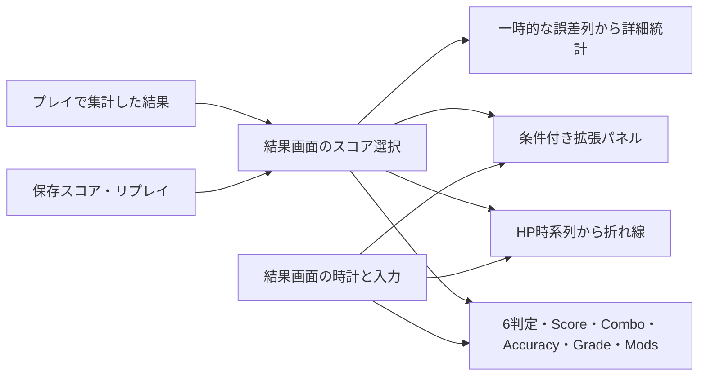

# stable b20230727.9 スコアリザルト画面の解析

調査日: 2026-09-29。対象はローカルにある指定build。**今回は読み取り専用の静的リバースエンジニアリングと公開資料の照合を行った。stable実機の結果画面に到達した、または1:1一致を検証した、という報告ではない。**

製品コードは変更していない。調査後の[再現計画](results-stable-plan-20260929.md)と、生成元まで追った[不足機能の実装計画](results-missing-data-plan-20260929.md)を別に記録した。

## 1. 対象・方法・制約

| 項目 | 記録 |
| --- | --- |
| Javaの基準commit | `d1bf8cbbb5d42e13697c60f20c6b69d4edc97c7d` |
| 専用worktree | `/home/coder/osujava-worktrees/stable-results-20260929` |
| branch | `research/stable-results-20260929` |
| stableディレクトリ | `/home/coder/workspace/b20230727.9` |
| `osu!.exe` SHA-256 | `bfa4ad675cdcd773b7b1c899e0a5e193d05d055d93e001271f06756c8185a28a` |
| `osu!ui.dll` SHA-256 | `a48f314c7ff381dfdd4fa16122accce45a397d0eb92afe5230aa999636358632` |
| `osu!gameplay.dll` SHA-256 | `ba3467a8db908d81a0729f78fdc5c8f1d1595d3da4e5a9a34be9a16e06da9f87` |

exeのCLR metadata / ILを`dnfile 0.18.0`、`dncil 1.0.2`で読んだ。DLLは対象同定のhash確認のみ。
難読名を復元したと見なさず、metadata token・参照元・参照先で役割を特定した。
本書のoffsetは**dncilのmethod headerを含むoffset**。一般のILビューアのoffsetとはheader分異なり得る。

公式asset・音源・fontの抽出、暗号化文字列ルーチンの実行、バイナリ改変、保護回避は行っていない。
stableは実行していない。公開wiki/GitHubは資料として閲覧したが、クライアントをBancho・osu! API等へ接続していない。
公式wikiの公開スクリーンショットを参照画像として目視した。これは指定buildを今回撮影した画像ではなく、ゲーム用素材にも使用しない。

[過去のオフライン起動試験](song-select-repair.md#stable-runtime-limitation)では、ネットワークnamespace内のWine/Mono/.NETで起動失敗し、更新画面までしか到達していない。
その試験を今回の結果画面の観測に読み替えない。別作業のWine・Xvfb・worktreeにも変更を加えていない。

以下では「IL確認」「公開資料」「Java確認」「設計判断」「未確認」を区別する。
静的解析で確定した呼出引数も、最終画素・音・入力dispatchの実測値とは区別する。

## 2. 特定した構造

起点はmetadataに残る`RankingDialog_*`のlocalisation ID 1225–1244と、その取得メソッド`0600392d`の呼出。
`06001f60`へ渡される画面の型から、メインの結果画面を特定した。

| token | 役割と根拠 |
| --- | --- |
| Type `02000385` | 結果画面。`06001a1f–06001a3d`に入力、初期化、スコア表示、グラフ、グレード、ボタン、描画順が集まる |
| Type `02000449` | 拡張結果パネル。`06001f60`にLocalRanking / GuestPlayerName / SaveReplay / AddOnlineFavourite等のlocalisation参照 |
| Type `02000282` | スコアデータ。6判定数、最大コンボ、mods、日時、HP列、詳細統計列を持つ |
| Type `020002bf` | 判定画像・数値の組。`06001488/1489`が別々のspriteと演出を作る |
| Type `020003c6` | HP折れ線。`06001c18`で点列を作り、`06001c1a`で時間に応じて描画する |
| `06001a2a` | 初期化。スコア選択→scroll container→時計・入力登録→背景装飾→panel / graph→header / buttons→値生成 |
| `06001a26` | スコアを受け取り、mode別判定群・combo・accuracy・統計tooltip・Perfect・grade・graph・modsを生成 |
| `06001a23 / 1a24` | 更新 / 描画。スコア各桁の確定、拡張パネルの遅延表示、別containerの合成 |



`06001a26`には4 modeのswitchがある。本調査・計画の実装対象は、現行osujavaに対応するosu!standardのcase 0。
他mode、対戦結果、オンラインランキングまで同一実装に含めるという意味ではない。

## 3. 表示データは最終スコア数値だけでは足りない

| スコアfield | 対応・確認方法 |
| --- | --- |
| `04000a3e / a3d / a3f` | 300 / 100 / 50。`060012e7`の重み300 / 100 / 50と、`06001a26`の左列が一致 |
| `04000a40 / a41 / a42` | Geki / Katu / Miss。6値の読み書き順`060012fb/12fc`を公開osr形式と照合。Missは精度分母にも入る |
| `04000a49` | 最大コンボ。結果画面`06001a26:0935–0940`、osr読込`060012fb` |
| `060012f0` | 表示スコアの取得。`04000a62`があれば委譲し、なければ`04000a59`。全modeで単一fieldの直接表示と仮定しない |
| `04000a43 / a51 / a44` | 日時 / プレイヤー名 / mods。headerのToLocalTime、mod enumとのAND、osr順で照合 |
| `04000a50` | Perfect用boolean。結果画面はこの値だけで画像の生成を分岐 |
| `04000a47` | HP graphの時刻・値の組。値はobject別基準HPに対する比。`06001c18`のX正規化と`1−Y`変換で確認 |
| `04000a55 / a56` | hit error / spinner統計用整数列。表示側`06001a26`、追加側`060021f9/21fa`を追跡 |

公開osr仕様も、6判定、最大コンボ、Perfect、mods、HP graphを別の値として保存する。[公式osr形式](https://osu.ppy.sh/wiki/en/Client/File_formats/osr_(file_format))
公開lazerのdecoderも6判定を別々に読み、PerfectとHP graphを読み飛ばす。**そのdecoderだけを移植してもstableの結果画面に必要な情報を保持できない。** [LegacyScoreDecoder](https://github.com/ppy/osu/blob/master/osu.Game/Scoring/Legacy/LegacyScoreDecoder.cs)

### Geki / Katuと精度

`060012e9`の分母は300 + 100 + 50 + Miss。Geki / Katuは足さない。
`060012e7`は分母が0以下なら1、それ以外は`(300*n300 + 100*n100 + 50*n50)/(300*N)`をSingleで計算する。
Geki / Katuはcombo set終端の判定variantであり、独立した精度判定を追加するものではない。[公式判定仕様](https://osu.ppy.sh/wiki/en/Gameplay/Judgement/osu!)

### PerfectとGradeは別

`06001a26:0b34–0b99`は`04000a50`でPerfect表示を決める。accuracyやgradeから逆算していない。
`06002648:002b–0049`では、集計側のcombo値`0400189e`と最大コンボを比較して同fieldを設定する。
追加確認では式は`!(0400189e − maxCombo > 0)`。単純なaccuracy比較でも、IL上の等値比較でもない。
公開osr仕様上も、Perfectはmiss・slider break・取り逃したslider終端がないことを表す。**100% accuracyと同値にしてはいけない。**
追加解析でstandardの生成元`06003a90`を特定した。circle / spinnerは各1、sliderはnested列長＋1を加える。[最大可能comboの根拠](results-stable-followup-20260929.md#82-最大可能comboの生成元)を参照。特殊譜面の実機挙動は未確認。

Gradeの`060012ec`はpass field `04000a4c`がfalseならF、通常の比率条件に加えてHD / FLのbitを見てXH / SHへ分岐する。
enum `0200024d`はXH, SH, X, S, A, B, C, D, F, Nを0–9に対応させる。
公開の条件表は[公式Grade仕様](https://osu.ppy.sh/wiki/en/Gameplay/Grade)を参照。

**境界値の未決事項:** ILは比率をSingleに置いてからDouble定数0.9 / 0.8 / 0.7 / 0.6と比較する。
Javaの`OsuGrade`は整数積で厳密比較する。IEEE binary32を使った独立計算では80/100は0.800000011920929、60/100は0.600000023841858となる。
対象CLR/JITでの実観測はなく、wikiの数学的条件とbuild固有の実際の境界を同一視できない。
80%・60%ちょうどのcaseを観測fixtureにし、今回の調査だけで既存gradeを変更しない。

## 4. 座標・skin・描画順

### 座標系

`06001dcb`は表示高/480、`06001dc9/1dca`は表示寸法をそのscaleで割ってCeilingする。
`060040af:0641–0726`で座標mode 6は左から、mode 8は右端からの距離として変換されることを確認した。
`060040a7`の第3引数はorigin。enum `02000aec`で0=TopLeft、1=Centre、3=TopRight、7=CentreRightを確認した。
画像の論理寸法側には1.6の係数があるため、**480高の位置と768高相当のskin画像寸法を混ぜない。**

下表はspriteに渡される480高の論理座標。レンダリング後のbounding boxではない。
`modern`は`06002ac8`の戻り値。通常skinではVersion>1の分岐があるが、global flag、既定skin等の例外も含むため、単純なVersion>=2の同義語ではない。

| 要素 | 旧分岐 / modern分岐 | origin / 根拠 |
| --- | --- | --- |
| panel | `(0,46)` / `(0,64)` | TopLeft、`06001a2b:0066–009e` |
| score | `(220,94)`、scale 1.05 / 1.30 | Centre、`06001a26:00d7–0134`。FontScore / FontScoreOverlap使用 |
| 左列画像 | 300 `(40,160)`、100 `(40,220)`、50 `(40,280)` | Centre、`06001a26:01a2–026f` |
| 右列画像 | Geki `(240,160)`、Katu `(240,220)`、Miss `(240,280)` | Centre、同`:0274–0341` |
| 判定数 | 画像のX+40、Y−25 / Y−16 | TopLeft、`06001488:00f3–010f`。数値scale 1.12、`06001489:004a–0050` |
| combo label | `(5,312)` / `(5,300)` | TopLeft、`06001a26:08d5–0904` |
| accuracy label | `(182,312)` / `(182,300)` | TopLeft、同`:0975–0996` |
| combo値 / accuracy値 | `(15,330)` / `(194,330)`、両分岐共通 | 同`:092a–0954 / 09bc–09ec` |
| graph画像 | `(160,360)` / `(160,380)` | TopLeft、`06001a2b:000d–0050` |
| graph内容 | frame位置+`(10,10)` / `+(5,5)`、幅186・高86の引数 | `06001a26:0bd2–0c32` |
| Perfect | `(200,430)` / `(260,430)`、最終scale 1 | Centre、同`:0b3c–0b8d` |
| grade | 右端から120、Y=170 / 200 | Centre、`06001a29:000d–006e` |
| title | 右端から20、Y=0 | TopRight、`06001a2a:0268–0297` |
| Mod列 | 右端から40、以後20ずつ、Y=260 | Centre、`06001a28:0014 / 0142–0161 / 019c–019f` |
| Retry / Replay | 右端から0、Y=360開始、配置されたボタンごとに+60 | CentreRight、`06001a2e:0118–0321` |

公式skin仕様の768高座標とも照合した。例: grade右192 / Y272・320、Perfect X320・416 / Y688、graph X256 / Y576・608。
panelはIL換算73.6・102.4に対しwikiは74・102。**wikiの整数をILの引数へ逆代入せず、丸めを別途観測する。**
結果画面部品のanchor、新旧配置、button名は[公式Interface skinning](https://osu.ppy.sh/wiki/en/Skinning/Interface#ranking-screen)が公開根拠。

### Skinの選択と欠損時

- 本文数値は通常fontではなく`FontScore / FontScoreOverlap`を使う。現行ResultsScreenの`String.format(Locale.ROOT)`＋UiTheme fontとは異なる。
- `06001488`は`06001b74`で静止画とanimation先頭候補を比較する。`06001b73`は存在だけでなくprovider値も比較する。
  同一providerなら静止画優先を含むが、上位providerの先頭frameが下位providerの静止画に勝つ経路もある。
  公開仕様の「静止画→frame 0→default」と[Skin独立調査のprovider表](skin-stable-independent-audit-20260929.md#1-画像探索と読み込み元)を併せて使う。
  [公式FAQ](https://osu.ppy.sh/wiki/en/Skinning/FAQ#ranking-screen-hit-score-hierarchy)
- 通常のranking部品でmask 7が渡されていても、loader側で譜面providerのbitが落ちる場合がある。
  「結果画面なら譜面skinが必ず有効」とは結論しない。公開仕様はranking部品のbeatmap skinningを不可としている。
- Retryは旧分岐で`ranking-retry`の汎用探索→選択skinのみ→`pause-retry`相当のfallback経路。
  modernでは最初の汎用探索を省く。Replayも旧分岐の`ranking-replay`→`pause-replay`相当の分岐を持つ。
  対応名は公開仕様・配置・callbackの照合に基づく。暗号化された文字列値そのものは今回復号していない。
- 複合panel画像のalphaを解析してlabelや数値を自動移動する処理は、この画面の生成経路にはない。

### 合成

`06001a24`はbase描画→`04001166`→scroll container `0400116e`→`04001168`の順。
`04001167`はscroll containerの内容。結果本体・header・ボタン・拡張パネルと、固定のBack等を同じ平面にしてはいけない。
生成時depth引数はpanel .2、score / 数値 / graph frame .8、graph線 .85、判定画像・grade .9、mods .92、Retry / Replay .94、Perfect .99、header / title .991。
depth引数、container順、加算合成のflagは別に扱う。最終的な描画順、clip、背景の動画・storyboard・暗転との関係は実機比較が残る。

## 5. 時系列と入力

| 処理 | IL確認 |
| --- | --- |
| 基準時刻 | `06001a2a:0183–018f`で共通時刻`040016c4`+300を保存 |
| score各桁 | `06001a23:0057–00e0`で経過時間/500の整数商を使い、左から確定文字へ置換。それ以降は乱数文字。数値を0から線形加算する方式ではない |
| 乱数 | `06001998`→`Random.Next(min,max)`。呼出引数は0,9であり、上限exclusiveなら未確定文字は0–8。再現性のあるseed・呼出順は未観測 |
| 判定画像 | `06001488`で300msのscale 1→.5とalpha 0→1、easing ID=2 |
| 判定数値 | `06001489`で画像基準+200から300ms、左40から目標位置へ移動しalpha 0→1、easing ID=1 |
| 表示順 | `06001a25`は遅延300から開始し、通常項目ごとに+300。case 0では300→100→50→Geki→Katu→Miss→combo→accuracy→条件付きPerfect |
| grade | `06001a29`。上記の遅延累計から1000ms、scale 2→1、alpha 0→1。enum<6の追加spriteは続く2400msでscale 1→1.05、alpha 1→0 |
| Mod | `06001a28`。各400ms、500msずらしてscale 2→1とalpha 0→1。NCありではDT、PFありではSDの重複を表示しない |
| HP graph | `06001a26`→`06001c18/1c1a`へ基準時刻と4000msを渡す |
| 拡張パネル | `06001a23:00e5–00f6`で経過>4400かつ特定の閲覧flagでなければ表示処理へ |
| 早送り | `06001a36`。経過<5000かつ未skipなら基準を現在−7000へ移し、非loop transformを終了済み時刻に変更してfalseを返す |

上のmsはコード上の時間値。spriteごとにも作成時の現在+300を持つため、全開始時刻が一つの定数から厳密に生成されると仮定しない。
easing ID 1/2の曲線、全時計の更新順、乱数seed、実フレーム上の開始点は未確認。

| 入力 | 確認した画面側の経路 |
| --- | --- |
| Esc | `06001a20:000c–0018`→戻る`06001a37`。演出skipとは別経路 |
| Enter / Space | 同`:0071–0084`→`06001a36(false)`。画面側handlerには、演出終了後に選曲へ戻すcallがない |
| F2相当のkey code 113 | 同`:0019–0070`。取得済み/未取得スコアの分岐を通り、保存側`06004299`へ。公開のリプレイ保存機能と対応 |
| Retry click | `06001a30`はskip処理の戻り値を無視し、busyでなければGameplay遷移へ |
| Replay click | `06001a2f`はskip処理の戻り値がtrueになるまで再生処理へ進まない。演出中の初回はskipで終わる経路 |
| Back | `06001a3a`→`06001a37` |
| 拡張結果ボタン | `06001a3d`がscrollへ高さ×.875と補間引数−.99を渡す |

「任意clickで戻る」「RでRetry」「Enterで選曲へ戻る」は、現行Javaの動作をそのままstable契約にしない。
画面全体click handler、hover領域、ドラッグ、wheel、global shortcutと上記callbackのdispatch順は未確認。
ボタン画像の存在・寸法・重なりに対する実際のhitboxも別途観測する。

## 6. HP graphと詳細統計

### graphはHPであり、accuracy推移ではない

`06001c18`はHP列の最初・最後のXを使って表示幅へ正規化し、Yを`(1−HP)*height`へ変換する。
100点を超える間は末尾側から一つおきに削る処理を繰り返す。平滑曲線をfitする処理ではない。
線分データに渡す色は、後端点のHP>0.5ならYellowGreen、それ以外はRed。最終合成色は実測が残る。
`06001c1a`は点のXだけでclipせず、折れ線の**累積長**を時間に応じて辿り、途中の線分は補間して切る。
この違いは上下動の大きいHP列で見える。スクロールoffsetにも追従する。
空列・1点・同一時刻・急落・101点以上を観測fixtureにする。1点/同一時刻を独自に描き足して同値と称しない。

### 追加調査: HP列の採取と保存は別処理

`06002202:0013–001b`は判定集計`0600264d`を呼んだ後、引数のbitmask `520095494`とのANDが正、かつ分母field `04001126`が正の場合にHP列へ追加する。
同`:0045–008a`では時刻field `040014b1`と、`min(1, 060027dcの戻り値 / 04001126)`をSingleの点へ変換して追加する。
`060027dc`は実際のHP field `0400197b`のgetter。追加解析で、分母は`06003a90`の全成功シミュレーションがobjectごとに保存するHPと確認した。固定の最大HP=200ではない。
maskに入るstandard判定codeとHP生成式は[追加解析](results-stable-followup-20260929.md#2-hpには3種類の量が必要)に記録した。nested失敗・overlap時の参照objectは確認を残す。毎frame採取ではない。

`06001300`は保存用文字列のcacheがあれば返し、なければHP列を走査する。
`:004a–006a`は**直前に保存した点から時刻差が2000を超える点、先頭、末尾**を選び、`:007e–00b4`はX / Yを小数第2位へ`Math.Round`してformatへ渡す。
文字列format自体は復号していない。時刻・HPのpair形式との照合根拠は公開osr仕様。
`:00cf–00e8`では元の列をClearしてnullにし、文字列をcacheする。この副作用までJavaへ移植する必要はなく、immutable snapshotと保存用変換を分ける設計根拠になる。

**未観測:** 直後の画面を作る前後のどの経路で文字列化するか、保存結果閲覧時の再構築順序。
結果描画の100点間引きと、この保存用の点選択を同じ処理として実装しない。

### 統計式

`06001a27`はnull/空列ならnull、それ以外は次の7値を返す。

1. 負の値だけの平均。該当なしなら0。
2. 0以上の値の平均。該当なしなら0。**0は後者の分母に入る。**
3. 全体の平均。
4. 全体の母分散: 二乗偏差和/N。N−1ではない。
5. 母標準偏差。
6. 最大値。ただし初期値0のため、全値負の場合は0が残る。
7. 最小値。

`06001a26:0a13–0aa5`がhit error列について平均の両側・標準偏差×10等をtooltipへ渡す。
`060021f9`の追加側は明示された誤差、またはプレイ時計−object時刻を保存する。
追加解析でstandard通常クリックの採取対象は成功circleと成功slider headと確認した。MISS・空打ち・notelock拒否は入らない。[採取経路と残る条件](results-stable-followup-20260929.md#5-urに入る入力)を参照。
spinner列は別に集計し、平均・最大・標準偏差×2を追加する。単位はupdate中の平滑化RPMを整数化したもの。[平滑化式と更新順](results-stable-followup-20260929.md#6-spinner結果統計は平滑化したrpm標本)を特定したが、実機での正確なupdate頻度の照合は残る。

公開仕様でもURは誤差の標準偏差×10で、直前プレイ・spectate・replayに限り表示される。
stableでは速度modを含む譜面時刻基準であり、近年のlazerの実時間基準とは違う。[公式Unstable rate](https://osu.ppy.sh/wiki/en/Gameplay/Unstable_rate)

独立した算術確認（stable実行ではない）:

| 誤差列ms | 負側平均 | 非負側平均 | UR |
| --- | --- | --- | --- |
| 空 | 表示値なし | 表示値なし | 表示値なし |
| `[0]` | 0 | 0 | 0 |
| `[-10,0,10]` | −10 | 5 | 81.649658… |
| `[-30,-10]` | −20 | 0 | 100 |
| `[12,12,12]` | 0 | 12 | 0 |

保存済みスコアにこの列がなければ、4判定数からURを推定できない。HP graphの有無とURの有無も独立して表す。

## 7. 拡張結果・ローカル条件

`06001a2c`は現在のプレイ結果と閲覧対象スコアを選択し、一部経路で直前プレイの誤差列をコピーする。
`06001a2d`はpass / 閲覧状態 / Relax・Autopilot bitなどで拡張パネル生成を分岐する。
**保存スコア閲覧とプレイ終了画面を同じboolean一つで処理する前に、各経路をfixtureで確定する必要がある。**

`06001f60`はローカル順位、guest名、リプレイ保存、online favourite、読込中表示を作り、オンライン状態のcallで表示を分ける。
`06001f66`にはaccuracy、ranked / total score、play count、pass rate等がある。
これは公開の[拡張結果画面](https://osu.ppy.sh/wiki/en/Client/Interface#extended-results-screen)とも整合する。
本調査ではオンライン側の計算・リクエストを再現しない。完全ローカルの1:1対象は、同じオフライン条件で到達できる表示と操作とする。
順位・pp・他人の記録を生成してオンライン画面を模倣する計画にはしない。

## 8. 現行Javaとの差

| Java側 | 確認した差・影響 |
| --- | --- |
| [ResultsScreen](../core/src/main/java/dev/osujava/ui/ResultsScreen.java) | UiThemeの角丸panel、4判定、固定文字、汎用fade。grade / Geki / Katu / Perfect / Mods / graph / 拡張領域なし |
| [ScoreState](../core/src/main/java/dev/osujava/gameplay/ScoreState.java) | score、combo、maxCombo、4判定、accuracyのみ。上記の不足をRendererだけでは解消できない |
| [LocalScore](../core/src/main/java/dev/osujava/score/LocalScore.java) | identity、日時、ScoreState。プレイヤー、mods、HP、詳細統計、replay capability、pass結果は保存しない |
| [ScoreTracker](../core/src/main/java/dev/osujava/gameplay/ScoreTracker.java) | 基本加点とnested score / comboを記録。stable score multiplier、combo set終端variant、HPの情報源ではない |
| [OsuGameplaySession](../core/src/main/java/dev/osujava/ruleset/osu/OsuGameplaySession.java) | 現在のslider head判定が通常countへ入り、nested eventは別加点。stable ScoreV1のslider全体判定とは別の課題 |
| [OsuGrade](../core/src/main/java/dev/osujava/ruleset/osu/OsuGrade.java) | 通常SS–Dを整数比率で算出。mod / pass / build固有の丸めを表さない |
| [GameplayScreen](../core/src/main/java/dev/osujava/ui/GameplayScreen.java) | clock終了→finish→manual保存→結果画面。画面構築時に再保存しない点は維持可能。終了待機の演出は未比較 |
| [SongSelectScreen](../core/src/main/java/dev/osujava/ui/SongSelectScreen.java) | local score行は選択・highlightであり、保存スコアの結果画面を開く動線は未実装 |
| [UiLayout](../core/src/main/java/dev/osujava/ui/theme/UiLayout.java) | 720高と最小横幅基準。stableの480高・右端anchorへ変換が必要。Song Selectまで変更する理由はない |

追加監査で、break / AudioLeadInを保持しないparser、音源EOFに依存する終了、時刻を持たないInput API、通常Modの未実装も確認した。
HP / passだけでなくScoreV1・replayにも影響する。ファイル別の根拠と実装単位は[不足一覧](results-missing-data-plan-20260929.md#1-追加監査で確認した不足)を参照。

**設計判断:** 結果画面の独立実装と、結果に渡すデータの拡充を分ける。見た目が一致するfixture表示と、実プレイのスコア値が一致することも別の合格条件にする。
完全ローカル、通常Input APIを使うDebug Auto、Import / Gameplay / Ruleset / Renderer / GameClockの分離を維持する。

## 9. 未確認項目と1:1を認定できない理由

- 指定buildの実機キャプチャ、入力ログ、音、終了直後から結果表示までの時刻差がない。
- 最終画素: font・spacing・桁数・小数点のlocale、拡大縮小の丸め、clip、SD/HD、背景、video / storyboard、cursor、加算合成。
- exact format文字列や音名は暗号化されているため未復元。公開資料と実機で埋める。復号実行や保護回避で補わない。
- generic easing、乱数sequence、全画面click dispatch、hover、wheel、キーrepeat、ボタン重なりの優先順位。
- HPの開始時充填・frame内順序・特殊譜面での係数探索、nested失敗時のgraph参照object、Geki / Katuのoverlap時の順序、特殊Mod／replayの入力dispatchとspinner標本頻度。
- 保存結果の閲覧flag、replay未所持 / ローカル所持 / Auto再生、offline guest入力、拡張パネルの全状態分岐。
- 公式built-in assetを抽出しない条件では、Javaに現在同梱された別skinとの画素一致は保証できない。同じ利用許諾済みcustom skinで比較する。

これらを推測で実装済み扱いにせず、[計画の観測ゲート](results-stable-plan-20260929.md#段階0-観測条件と未確定分岐を閉じる)にする。
HP係数の主要分岐、standardの最大可能combo、通常入力のUR採取対象、spinnerのRPM・判定・旧replay条件は[追加解析](results-stable-followup-20260929.md)で更新した。静的な式の確定と実機一致の認定は分ける。

## 10. 再調査の手順と成果物

読み取り専用toolを[tools/stable_results_inspect.py](../tools/stable_results_inspect.py)に保存した。
異なるexe hashは拒否する。assemblyを実行せず、resource抽出・user string復元も行わない。
初期状態では主要5型のfield / method tokenを列挙する。`--ranking-locations`はlocalisation callから起点を再発見する。

```sh
python3 -m venv /tmp/osujava-results-inspection-venv
/tmp/osujava-results-inspection-venv/bin/pip install dnfile==0.18.0 dncil==1.0.2
/tmp/osujava-results-inspection-venv/bin/python tools/stable_results_inspect.py \
  '/home/coder/workspace/b20230727.9/osu!.exe' --ranking-locations
/tmp/osujava-results-inspection-venv/bin/python tools/stable_results_inspect.py \
  '/home/coder/workspace/b20230727.9/osu!.exe' --methods 06001a26 06001a27 06001a36
/tmp/osujava-results-inspection-venv/bin/python tools/stable_results_inspect.py \
  '/home/coder/workspace/b20230727.9/osu!.exe' --refs 04000a50 04000a55
```

追加で読むべきtokenは各節の表に記載。生IL・資料キャプチャは`/tmp/osujava-results-research-20260929/`にあり、Gitへ含めない。
Gitには独立に記述した調査結果・再現計画・読み取り専用toolだけを保存する。

公開資料は2026-09-29の閲覧時点。wikiやlazerのmasterは更新され得るので、このbuildのILと同じ版だとは扱わない。
wiki結果画像の[公開元](https://github.com/ppy/osu-wiki/blob/master/wiki/Client/Interface/img/results-osu.jpg)は画面の構成確認に使用し、定量的なbuild比較には使用しなかった。

検証: `./gradlew --offline build`成功（core **837 tests / 101 suites、failure・error・skipとも0**、desktop harnessのcompileを含む）。
toolで統計・skipメソッドを再読し、localisationから7メソッドを再発見した。全method走査のparse失敗は0。
異なるhashの拒否、Python構文、Git diffの検証も実施した。
このbuild成功は製品の既存状態の検証であり、stable画面との一致の証拠ではない。
