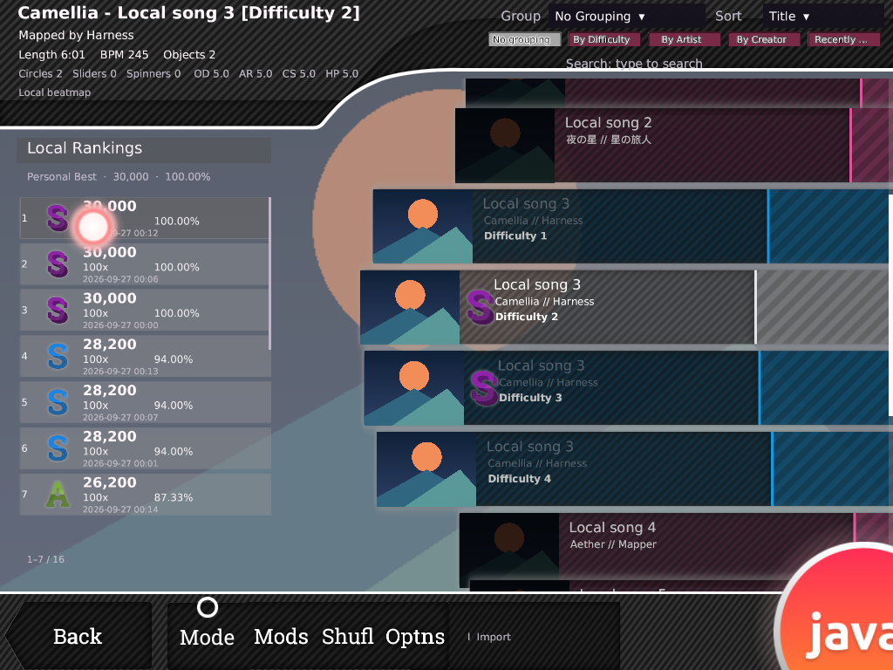
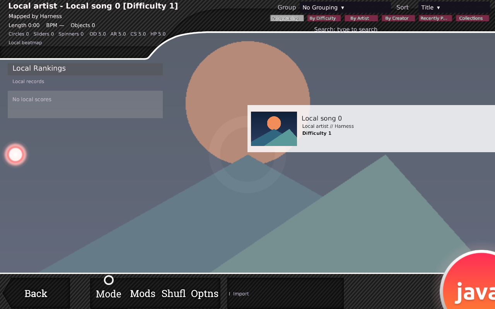

# Song Select監査の残件対応 — 2026-10-02

前回の[全面監査](songselect-full-audit-20261002.md)の続き。開始HEADは`9c785cc`。
今回はpartial skinの文字色と、carouselの描画canvas/input矩形の不一致を修復した。
stableの入力優先値とHD条件も再調査したが、その全契約の一致を完了扱いにはしない。

## 修正・設計判断

### partial skinの未指定文字色

選択skinにmenu-button-backgroundがない場合、画像はconfigured fallbackまたはbundledへ
切り替わる。しかし文字色は選択skinのskin.ini既定値のままなので、暗いfallback背景に黒い
active textが重なる場合があった。

[公式skin.ini](https://osu.ppy.sh/wiki/en/Skinning/skin.ini)の既定色自体は変更しない。
parserがactive/inactiveそれぞれの有効な明示指定を記録し、**背景が別providerに由来し、
その色が未指定の場合だけ**、背景providerのpaletteを補う。指定済みの黒も作者指定として維持する。
invalid値、大小文字、同section内の最初のキーを使う規則も維持する。

これはosu!javaのfallback表示方針であり、stable固有のpalette探索契約の再現とは主張しない。
Greylooksの名前や輝度閾値に依存せず、configured fallbackでも同じ規則を使う。
fallbackに色指定がなければ通常の既定値を使う。
custom背景（透明画像を含む）、選択skinのVersion/Fonts、画像pixels、densityは変更しない。
skin load時に一度計算し、Screen→Rendererの既存色入力へ接続する。

### carouselの描画/input共有canvas

従来はnative sizeで描いた画像と、72 UI高のnavigation bodyでhitを判定していた。
例として700×117 SDの背景は720高canvasで656.25×109.6875 UIに描かれる。
画像の上下部分をクリックできず、狭いcustom画像では画像の右外側もhitしていた。

`SongSelectArtwork.row()`がcentre-leftの描画矩形を決め、immutable Row snapshotがそれを保持する。
Renderer、hover/press、押下identityへのrelease、layoutのinputClip/hitが同じ矩形を使う。
navigation pitch、文字/thumbnailの配置、motionは維持する。画像がなければprocedural bodyを使う。
native logical sizeの整数除算とodd HD pixel cropを維持し、alpha scanや毎frame texture生成を追加しない。
画面・chrome予約領域外のinput除外とcarousel scissorも維持する。

captureは自作の図形fixtureと同梱Greylooks（CC BY 4.0、既存notice参照）を使用。
stableから抽出したassetを含まない。canvasのclick/releaseは下記harnessで別途検証する。

## stable再調査の根拠

対象は前回と同じb20230727.9、SHA-256
`bfa4ad675cdcd773b7b1c899e0a5e193d05d055d93e001271f06756c8185a28a`。
`tools/stable_results_inspect.py`でCLR metadata/ILを読み取り専用で確認した。
binary起動、resource/公式asset抽出、文字列復号、保護回避を行っていない。
アプリへのnetwork機能を追加していない。

| 根拠 | 確認事項と適用範囲 |
| --- | --- |
| `060040af` `0db8–0e84`、`060040cf` `000c–0015` | sprite寸法・origin・絶対scaleで矩形を作る。通常hit矩形のPNG alpha scanなし。既存native canvasの寸法をinputへ接続 |
| `060040ce`、`06005142`、`0600513d` | 回転なしでは矩形判定。left/topを含みright/bottomを除く。Java Y-upへの既存変換を維持 |
| `060040a7` `005c–006c`、`06002c1f` `004e–0067` | mouse priority `0400285b`はsprite生成時のdepthの負値。重複ではより小さいpriorityを選び、同値では先の候補を保持。現在の描画depthを直接比較しているわけではない |
| `06000fbf` `00db–00e9`、`060025e8` `0045–0053`、`06003287` | 通常行・Group背景のconstructorへrow depthを渡す。row depthはbrowser順に.6から.00003刻み |
| `06003256`、`06003267`、`06000fd6` | 新hover取得にはbackground opacity==1の条件があり、既存hoverと扱いが違う。drag/right-scroll中はhover更新を止める |
| `06002340` | `(displayHeight>=800 OR option04000d19) AND !option04000d26 AND maxTexture04001851>2048`を再確認 |

[公式HD画像仕様](https://osu.ppy.sh/wiki/en/Skinning/FAQ#hd-images)も800px高を開始条件とし、
LowResolutionはSDのみ、HighResolutionはHD優先・SD fallbackと説明している。
しかしJavaのwindow/framebuffer値とnative display値の対応、二つのoptionの全設定元・寿命、
reload時点は未確定。既存のHD探索をresizeだけで切り替える変更は今回行っていない。

## 検証

- `./gradlew :core:test --offline --console=plain --tests 'dev.osujava.skin.*'`成功。
  未指定/invalid/明示black、bundled/configured fallback、custom透明、画像なし、HDを検証。
- `./gradlew :core:test --offline --console=plain --tests 'dev.osujava.ui.SongSelect*'`成功、409 tests。
  追加canvasテストは720/768/800/1080高、SD/odd HD、narrow/tall、missing、logical size=0、
  viewport clip、top-left矩形の各edgeを検証する。
- `songSelectVisualHarness -PsongSelectPhase=audit`成功。
  **84 scenes / 172 PNG / 1,256 scripted frames**、navigation/disposal checksも成功。
  1280×720、1280×800、1024×768、1280×720のframebuffer 2倍。
  前回72 scenesにpartial paletteと通常/狭幅canvasの3 cases×4 profileを追加した。
  native canvasのbody外部分で実際のpress→release→play requestを検証。
  既存のempty/single/many difficulty、long/Unicode metadata、thumbnail欠損、search 0件、
  local score 0/1/多数、wheel/hover/selection、巨大score背景clip、live resize、巨大/透明chrome、
  save/reloadが引き続き通る。nativeとの同期captureや実ユーザーskin全件の検証ではない。
  84 scenesは`eb0c7dd`時点。最後のfallback allocation削減後は、4:3・framebuffer 2倍の
  `phase4-fallback`の別run（1 scene / 1 PNG / 2 scripted frames）とnavigation/disposalも成功。
- `./gradlew build --offline --console=plain`成功。
  core 129 suites / **1,249 tests**、lwjgl3 2 suites / **4 tests**。
  failures/errors/skipsはすべて0。

ログ: `/tmp/osujava-remaining-{palette-tests,hit-tests,palette-harness,row-hit-harness,audit-harness,build}.log`。
全capture: `/tmp/osujava-remaining-audit`、追加case単独: `/tmp/osujava-remaining-palette-4x3`、
`/tmp/osujava-remaining-row-hit`。
最終fallback run: `/tmp/osujava-remaining-fallback-final.log`、captureは同名directory。

## 性能

既存GLなしproduction update probeを変更せず使用。1,200 warmup / 1,200 samples、512MiB固定heap。
開始HEAD `9c785cc`の変更対象UI 5 classesを`/tmp`へ独立compileしてclasspath先頭へ置いたbeforeと、
最終main classesのafterを交互に3回ずつ実行した。測定中はvisual harnessを実行していない。
[全180測定CSV](songselect-follow-up-performance-20261002.csv)を保存した。

| Sets / 操作 | 平均の中央値 before → after (µs) | p95の中央値 before → after (µs) |
| --- | ---: | ---: |
| 100 / idle | 26.184 → 33.726 | 22.261 → 21.901 |
| 1,000 / idle | 20.154 → 23.698 | 26.780 → 18.936 |
| 10,000 / idle | 89.715 → 70.402 | 73.128 → 76.123 |
| 10,000 / wheel | 61.802 → 65.348 | 69.751 → 70.833 |
| 10,000 / fast-wheel | 67.502 → 76.344 | 85.731 → 93.626 |
| 10,000 / selection | 482.007 → 408.106 | 4,314.080 → 4,094.527 |

平均はoutlier/JIT/GCの影響を受け、全条件で高速化したわけではない。
表の10,000 Setsのidle/wheel/fast-wheelではp95増分は最大約8µs。
selectionは重い状態変更を含む別scenario。
各3 runの計測中GCはbefore 3回/6ms、after 3回/8ms。
GPU、font rasterization、image decode、音声、実機FPSを測った結果ではない。

最初の比較で画像なしbodyにも余分なBounds生成があると分かったため、最終実装では
既存body座標をinput/Layoutへ直接使う。10,000 Setsではallocation増分を約1KBから
約0.22–0.25KB/frameへ減らした（最終idle 12,009.1→12,256.0 bytes/frame、3 run中央値）。
これは可視Row snapshotへ加わった参照等の分であり、全beatmap layout再計算を追加しない。
native画像がある場合は、その可視Rowの共有canvasを使い、Rendererでの二重計算を除く。
色paletteはload時だけ読み、毎frame texture/font生成やPNG alpha scanは追加しない。

## 未完了項目と次の実装単位

| 優先度 | 残件 | 次に必要な比較・作業 |
| --- | --- | --- |
| P1 | global dispatcher/frame順序の最終native比較 | [row入力の続き](songselect-row-input-follow-up-20261002.md)でselected優先を廃止し、生成時priority・opacity・既存hover・復帰fadeを接続。展開直後の再生も維持。native登録途中の候補更新とJava snapshot評価のframe差を同期captureで閉じる |
| P1 | native pixel rounding、dispatcher/callback時刻・focus境界 | 同じ許可skinでpointerをpixel単位に動かすnative capture。今回の共有canvasはJavaの描画/input一致であり最終native hitの完全一致ではない |
| P1 | HD eligibility | 上記二optionとdisplay/GL条件を確定し、799/800高・SD/HD同時・HD-only・resize/reloadを比較。Gameplay/Resultsの共通resolverを不用意に変えない |
| P1 | 明示的な黒色＋暗いfallback背景、skinの全frame合成・font/metadata typography | 明示色は尊重するためcontrastを自動改変しない。同じ許可skin/fontのnative比較が必要。bundled素材は引き続きGreylooks |
| P1/P2 | Mods/他mode/Options、未対応tabs、rating/statusのローカルsource、ranking player/mods/replayとthumb drag、preview/focus/復帰契約 | [前回残件表](songselect-full-audit-20261002.md#残件と次の作業)を継続。backend/実データがないUIの有効化や値の捏造をしない |

下部button alpha-based hit、Backの全provider/INI/音alias契約、safety clipとnative無制限managerの差、
Cookie/拍/粒子の素材・時計差も前回の残件として維持する。
新規assetは追加しておらず、前回の48画像・12音の分類は変わらない。

## 変更ファイル・commit

- `SkinConfiguration`, `SkinAssetResolver`, `SongSelectSkinAssets`, `SongSelectScreen`: 色指定の有無とcached fallback palette。
- `SongSelectArtwork`, `SongSelectRow`, `SongSelectLayout`, `SongSelectRowRenderer`, `SongSelectScreen`: shared canvasとinput接続。
- `SkinConfigurationTest`, `SongSelectSkinAssetsTest`, `SongSelectArtworkTest`, `SongSelectVisualHarness`: 回帰検証。

実装commit:

- `ced8d5f` — `fix(song-select): pair omitted text colours with inherited row artwork`
- `eb0c7dd` — `fix(song-select): share native row canvas between drawing and input`
- `c9d0775` — `perf(song-select): reuse procedural body bounds in fallback snapshots`

調査dumpは`/tmp/osujava-remaining-{hit,dispatch,hover,native-row,mouse-geometry,priority,background-create}.il`、
xrefは`/tmp/osujava-remaining-{hit,hover,priority}-refs.txt`。
