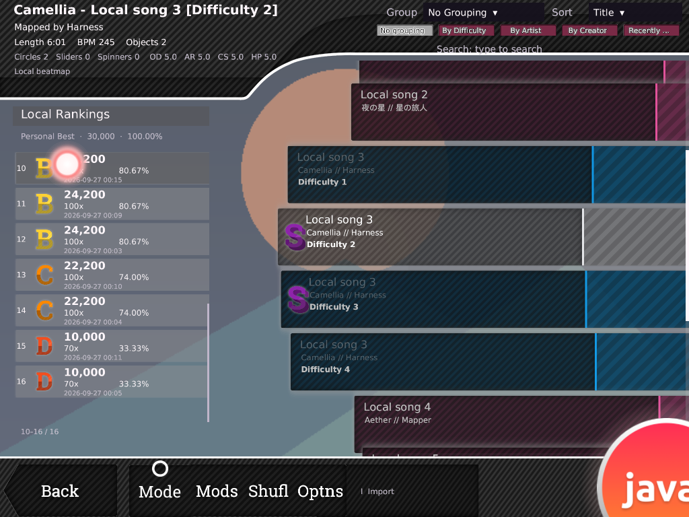
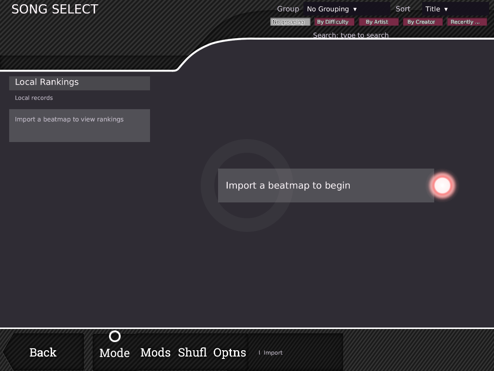
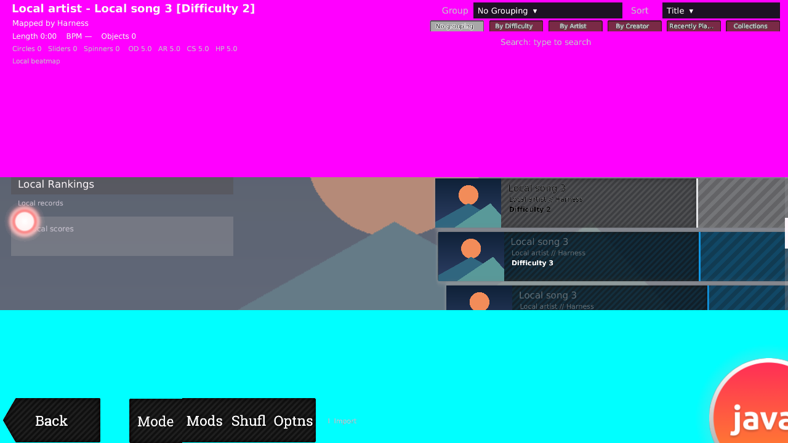

# Song Select 全面監査と修復（2026-10-02）

開始commit: `5c75af7`。作業開始時のworking treeはclean。
Screen / Renderer / RowRenderer / Layout / Carousel / BrowserModel / Input / SkinAssets /
AssetResolver / Toolbox / ScoreBrowser / LocalScoreStore / Preview / Audio / thumbnails /
既存unit test / visual harnessを横断して確認した。
完全ローカル、Java 21、libGDX/LWJGL3、Gameplay/Input/GameClockの分離は維持。
今回のコードからネットワーク処理や新しいGameplay機能を追加していない。

全領域の監査と優先する表示・入力修復を実施した。**stableとの画素・全挙動1:1は未認定**。
既存機能、今回閉じた問題、未解決の仕様・backendを区別する。

## 根拠と確認方法

- [公式Interface wiki](https://osu.ppy.sh/wiki/en/Client/Interface): metadata、carousel、ランキング、toolbox。
  Local Rankingと0件時の表示が存在する。オンライン順位をローカル結果から作らない。
- [公式Interface skinning](https://osu.ppy.sh/wiki/en/Skinning/Interface#song-selection):
  topはTop Left、bottomはBottom Leftで横幅100%へstretch。top延長は元画像より下層。
  selection normal/over、tab、star、mode画像の用途を確認。
- [公式Song Select画像](https://raw.githubusercontent.com/ppy/osu-wiki/master/wiki/Client/Interface/img/song-selection.jpg):
  1280×720の歴史的なdefault skin例。左metadata／スコア、右carousel、下toolbox、
  gradeとscore/combo/accuracyの情報階層、約50pxのスコア間隔を目視確認。
  Global Rankingの画像なのでplayer/avatar/mods/PBをローカルに捏造する根拠にはしない。
  この外部画像はGitへ保存していない。
- 読み取り専用CLR metadata/IL調査: `/home/coder/workspace/b20230727.9/osu!.exe`、
  SHA-256 `bfa4ad675cdcd773b7b1c899e0a5e193d05d055d93e001271f06756c8185a28a`。
  repositoryの`tools/stable_results_inspect.py`、dnfile 0.18.0 / dncil 1.0.2を使用。
  binary起動、公式asset抽出、暗号化文字列復号、保護回避を行っていない。
  stable実機の入力・画素captureは今回実施していない。

新たに再確認したランキング契約:

| 対象 | 根拠 | 独立実装への反映 |
| --- | --- | --- |
| スコア間隔 | `060013b3`, `03bd–03c2`: 次の位置へ33を加算 | 480基準の33 → 720 UI基準49.5。従来68を修正 |
| 背景canvas | `060013b4`, `08d5–0917`, `0af2–0af8` | menu-button-background、CentreLeft、native asset scale × .55を維持 |
| hover | `060013b4`, `0a66–0a7e` | alpha .3→.6、200msのlinear変化を接続 |
| 上部延長、Back/selection順 | 既存[調査記録](songselect-parity-implementation-progress-20261002.md) | 整数HD寸法、crop、幅gate、Back→selection順を維持 |

位置の全契約を確定したという主張ではない。45 UI高のスコアbody、columnの余白、
日時行、scroll indicator、空ライブラリ案内はosu!javaのローカル表示方針。

## 全領域の結果

| 領域 | 発見・現状 | 対応と残差 |
| --- | --- | --- |
| top chrome | 読込・描画・native scale・HD/crop・延長あり。reservationは40%までなのに描画clipは全画面 | 巨大画像が画面中央を覆う既存画素テストを実際に再現。描画も上40%内へclip。幅に合わせた拡大なし |
| bottom chrome | native高、横stretch、ボタンより先に描画。reservationは30%までなのに描画clipは全画面 | 下30%へclipしnative scaleを維持。通常90 SD高やtransparent replacementは保持 |
| ranking | 未実装ではない。難易度identity・revisionに追従してlocal scoreを描画し、clickで保存結果を開く | 68pitch、即時hover、clip不足、狭いcolumnの数値配置を修正。0/1/多数、grade、Results導線を検証 |
| metadata | Title/Artist/Difficulty/Creator、Length/BPM/Objects、circle/slider/spinner、CS/AR/OD/HP、Local statusが描画済み | cache維持。ratingを供給した場合のみstars。productionのrating sourceは未実装で値を作らない。font/階層の厳密一致は残る |
| carousel | resident/visible range、native canvas、状態別の色・foreground・星・motionが実装済み | RowRendererがscissorを強制解除しておりreserved領域へ侵入。body/thumbnail/text/star/hover全体に共通viewportを適用 |
| column境界 | 4:3のscore列幅が最左row位置より右へ出る | 最大open/hover indentを含むwheelLeftからscore列幅を決め、16 UIのcolumn gapを確保 |
| input | pressのhitはchromeを除外するがreleaseは生のbodyだけを検査 | releaseにもwindow/予約領域の境界を適用。dropdown表示中のrow hoverも抑止 |
| search/sort/group | typing/IME用surrogate、query、sort/group、tab/menus、wheel等の実装あり | 未呼出rendererは見つからず。unavailable tabは既存の明示案内を維持。backendなしのbuttonは追加しない |
| mode/mods/random/options/back | 各normal/over、legacy anchor、Back animation、hover、action/hitあり | random/back/play/import維持。Mods、他Ruleset、Optionsのbackend不足は意図的制約として残す |
| empty carousel | 案内背景と文字が別のhardcoded座標。文字が背景より左に出る | shared layoutの同じRectへ統合。chrome内へ侵入せず、空libraryと検索0件を区別 |
| 背景 | ローカル背景＋cache、欠損時は既存暗色background、thumbnail欠損は矩形 | 異常画像で終了しない。実曲のcold decode/preview切替は別の性能検証が必要 |
| performance | visible/resident projectionと事前load、text/font cacheあり | hoverは可視slot分だけ更新。新しい毎frame texture/font生成、全beatmap layout scanは追加しない |

## skin asset棚卸し

画像48名すべてのconsumer、SD/HD実寸、整数logical寸法、providerを
[一覧TSV](songselect-full-audit-assets-20261002.tsv)へ記録した。
@2xは各provider内で先に探し、current→configured fallback→bundled。
CURSOR_MIDDLEだけはcursorのproviderへ結合する既存契約を維持する。
Menu背景のalpha scan削除は、top/Back/selectionの必要なalpha測定を変更しない。

| 分類 | 対象と用途 |
| --- | --- |
| 1 使用中: chrome | `songselect-top`, `songselect-bottom`, `menu-back`と同provider連番 |
| 1 使用中: rows/ranking | `menu-button-background`, `star`, `ranking-X-small`, `ranking-S-small`, `ranking-A/B/C/D-small` |
| 1 使用中: 下操作 | `selection-mode/mods/random/options`と各`-over` |
| 1 使用中: 上操作・装飾 | `selection-tab`, `star2`, `cursor`, `cursortrail`, 条件付き`cursormiddle` |
| 1 使用中: mode family | `mode-osu/taiko/fruits/mania`、各`-small`、各`-med`: 拍装飾、下部/行、selector |
| 1 使用中: Mods selector | `selection-mod-nofail/easy/halftime/hidden/hardrock/suddendeath/doubletime/flashlight/relax/relax2/spunout/autoplay`。UI画像は使用するがGameplay有効化は不可 |
| 2 意図的に未使用 | `rank-forum`等のonline機能、silver grade（visibility Modsがない）、replay/player/avatar/mods-score欄。`menu-background`はSong Select loader対象外でローカル譜面背景を使う。Results/HUD用の大きいranking画像やscore digit画像もこの一覧の対象外。不要なloadを追加しない |
| 3 実装漏れ | loaderにあるが一切描画先がない画像は0。既存rankingとgrade等を新規実装扱いにはしない。hoverの時間変化とindicator、shared clipの接続漏れを修復 |
| 4 fallbackのみ | bundledの12 mode画像はmissing/1px placeholderから生成glyphへ置換。custom画像があればそれを使用。欠損starは生成星、gradeは文字、chrome/buttonsはprocedural代替。bundled `star2`は透明1pxなので装飾が見えない。customの透明replacementは意図を尊重 |
| 5 obsolete | `rowBody`/`SongSelectBodyBounds`とmenu背景の再decode/alpha scan。唯一のconsumerは過去のgeometry構成で、現行native canvas描画には不要。型・専用テストを除去し、Backのfixture検証は同じ数値で維持 |

音12名はすべて`SongSelectAudio`のinput/update経路から使用される:
`select-expand`, `select-difficulty`, `menuclick`, `menuback`, `menuhit`,
`click-short-confirm`, `click-short`, `back-button-hover`, `key-press-1/2/3/4`。
既存の通常Mods `active=empty` / `toggle=false`はdead code扱いにしない。
現在のRulesetが対応しないことを表すcapability境界であり、Debug Autoは通常Input経由のF6のみ。

ほかに、読み出されないSet単位のrow metadata cache、計算内だけで必要なCookie座標field、
未使用Renderer import/colour、重複したgrade fit関数を整理した。
Grade fitはzero logical sizeのguardを持つ共有skin drawingへ統一した。
`ScoreBrowserBounds.of`の独自座標計算もLayout snapshotへ統合した。

## 合成とlayout判断

背景 → dim/拍/粒子 → carousel（viewport clip）→ fallback chrome/右scrollbar →
score背景（各row clip）→ top/bottom skin chrome（上限clip）→
controls/score selection/indicator → metadata/ranking header・footer → score文字/grade（score viewport clip）→
Back normal/additive → selection normal/over → Java Cookie/foreground labels → menus/selector → transition → cursor。

score背景がchromeより前なのはnativeのdepth契約を維持するため。
selection compositeがmetadata/ランキングに重なる場合は作者のcanvasを維持する。
top/bottomの異常canvas上限、carouselのreserved viewport、scoreのrow単位clipは
**ユーザー要求に従うosu!java方針**であり、stableの無制限なsprite managerを完全再現したとはしない。
SD/HDのdensity、origin、native canvas、normal/hoverの描画/入力分離、Back animationは保持する。







以上はJavaの自作beatmap/幾何fixtureとbundled Greylooks（iZaIxSP、CC BY 4.0）のcapture。
公式asset抽出物ではない。[素材の出典](../THIRD_PARTY_ASSETS.md)を参照。

## 検証

- 全体`audit`: **72 scenes / 160 PNG / 1,232 scripted frames**、navigation/disposal成功。
  1280×720、1280×800、1024×768、1280×720 framebuffer 2x。
  empty/single、many difficulties、collapse/wheel reversal、長いmetadata/Unicode、thumbnail欠損、検索0件、
  scores 0/1/多数、score wheel、oversized score artwork、transparent/giant chrome、score save/reloadを含む。
- resize単独: **1 scene / 5 PNG / 98 frames**。
  同じScreenを1024×768→1280×800→1920×1080→1280×720へresizeし、
  score target/UUID selection/scroll clamp、column非重複、draw/input geometryを検証。
- layout修正段階の既存`repair`: **80 scenes / 252 PNG / 1,956 frames**、navigation/disposal成功。
  1,003 row libraryの既存描画probeも実行。これはランキング修正前の結果。
- cleanup/empty修正後の個別case: **repair-empty 1 scene / 1 PNG**、
  **oversized-score 1024×768 framebuffer 2x 1 scene / 1 PNG / 2 frames**成功。
  巨大背景を含むscore passには各row外側とgapの画素sentinel検査を追加した。
- 追加unit regression: chrome clipとSD/HD、4:3 column境界、chrome内でのrow release、
  empty layout、score pitch/gap/indicator、hover 200ms/30・60・144Hz、scroll/resize/target変更時のhover寿命。
- 最終`./gradlew build --offline --console=plain`: **BUILD SUCCESSFUL**。
  core **129 suites / 1,244 tests**、desktop **2 suites / 4 tests**、failure/error/skipすべて0。
  最終ログは`/tmp/osujava-audit-final-build.log`。obsolete helper専用テストの除去後の件数。

`audit`はランキング修正commitの実行を開始した後、cleanupを実施した。
cleanupとemptyの最終差分は全unit/buildと上記個別caseで確認した。
Import/再起動は既存Library/ScoreStore unit testとsave/reload harnessを使用。
実ファイルをGUIへdrop→実音声preview→再起動という全実アプリ通し操作は未実施。
入力のunit/transition検査と、全状態のnative画素比較は別の検証。

```sh
./gradlew build --offline --console=plain
JAVA_TOOL_OPTIONS=-Xmx256m MALLOC_ARENA_MAX=2 LP_NUM_THREADS=1 \
  xvfb-run -a ./gradlew :lwjgl3:songSelectVisualHarness --offline --console=plain \
  -PsongSelectPhase=audit -PsongSelectOutput=/tmp/osujava-audit
./gradlew :core:songSelectPerformanceProbe --offline --console=plain
```

harnessのheap/allocator/thread制限は検証プロセスだけの設定。製品起動設定は変更しない。
最初の`phase4`全件runとその時点のbuildはユーザーの継続入力で中断されたため合格に数えない。
上の`audit`/個別case/buildはその後完了したrun。

## 性能

開始commitの一時worktreeと修正後を同じJava 21 / 1280×720 / 60Hz / 512MiBで各3回。
1,200 warmup / 1,200 samplesの既存GLなしproduction update probe。
visual harnessと重なった追加runは除外して再実行した。
[全値CSV](songselect-full-audit-performance-20261002.csv)を保存。

| set数・scenario | 開始commit mean中央値 µs | 修正後 mean中央値 µs |
| --- | ---: | ---: |
| 100 idle | 12.922 | 13.209 |
| 1,000 idle | 13.499 | 13.842 |
| 10,000 idle | 56.266 | 53.023 |
| 10,000 wheel | 49.473 | 51.327 |
| 10,000 selection | 300.994 | 300.981 |

10,000 selectionのp95中央値は2,746→2,777µs、allocationは約121KB/eventを含むframeで同程度。
既存O(N) selection処理は残る。今回のhoverは可視score slotのarrayだけを保持し、
Frameへ渡すcopyもその容量分。新たな全library scan、GL texture/font生成はない。
このprobeにはGPU、実曲画像decode、音声、scoreを実描画するコストが入らない。
スコアが多い描画の厳密な前後benchmarkまで合格と主張しない。

## 残件と次の作業

| 優先度 | 残るstableとの差異 | 次の具体的作業 |
| --- | --- | --- |
| P1 | custom skinの全frame合成、metadata typography/font metrics。built-in fallbackの見た目はGreylooksで公式defaultとは異なる | 同じ許可font/skinを使うnative captureを720/800/768高で取得。[残件対応](songselect-follow-up-20261002.md)で未指定色とfallback背景の組合せを修復。明示的な黒指定は尊重する |
| P1 | global dispatcherのframe順序、native pixel roundingが残る | [canvas共有](songselect-follow-up-20261002.md)と[row入力修復](songselect-row-input-follow-up-20261002.md)でselected優先を廃止し、生成時priority/opacity/hover寿命を接続。native登録途中の候補更新、click/releaseとcallbackをpixel/frame単位で比較 |
| P1 | HD eligibilityは常時HD優先。nativeはdisplay height/option/GL capability条件。Back連番provider、mask/INI owner/音aliasも部分未確定 | [既存差分台帳](songselect-one-to-one-gap-ledger-20261002.md) V07–V13のfixtureを閉じる |
| P1 | 通常Mods/他mode gameplay/Options、Difficulty/Recently Played/Collections tabの実機能なし | 各Ruleset・rating・collection/backendを実装してから現在のcapability境界へ接続。見せかけの有効化をしない |
| P1 | production star rating sourceなし。metadataに本当のranked statusなし | 独立した信頼できるローカルdifficulty計算・metadata sourceを用意。表示済みのSettingsからstarsを作らない |
| P2 | player/mods/replayを保存していない。score indicatorは位置表示だけでdragできない。rank UIの全native座標は未確定 | ローカルschemaに実データがある機能だけ追加。thumb drag/hitをmodel操作として実装しnative layoutと比較 |
| P2 | 同じ音声pathのdifficulty変更でPreviewTime変更を適用しない、未指定seek=0。preview/fade/loop/背景遷移の全契約は未測定 | T01/T02の同path別難易度、load失敗、Gameplay復帰、focus/minimizeの入力列を観測 |
| P2 | safety上限/row scissorはnativeとの差。極端なportraitではscore幅が0になり表示対象外 | 正常skinのnative manager範囲と安全方針を区別。portraitを対応対象にするなら専用responsive方針を追加 |
| P2 | CookieはJava素材、拍/粒子は近似。hoverと入退場の全native時計を比較していない | 再配布可能な独自素材と、音声position/frame時刻を固定した比較fixtureで確認 |
| 対象外 | Bancho/online rankings/chat/profile/official website操作 | 完全ローカル要件のため接続しない |

既存差分台帳のV04/V17/V18/I02の一部を今回修復したが、ID全体を完了扱いにはしない。

## 変更ファイル・commit

- `SongSelectChrome`, `SongSelectLayout`, `ScoreBrowserBounds`: 共通予約/empty/score geometry。
- `SongSelectRenderer`, `SongSelectRowRenderer`, `SongSelectScreen`, `SongSelectRow`,
  新規`SongSelectScoreHover`: clip、score描画、hover snapshot、入力、cache。
- `SongSelectSkinAssets`: obsolete背景scan除去。Import/Gameplay/Ruleset/score schema変更なし。
- Layout/Chrome/ScoreBrowser/Hover unit tests、`SongSelectVisualHarness`: regression、画素sentinel、live resize、audit suite。
- 本書、asset TSV、performance CSV、3 capture。

実装commit:

- `14e9781` — `fix(song-select): bound chrome and align browser clipping with input`
- `8a19c12` — `fix(song-select): align local ranking rows and animate score hover`
- `a57cfd7` — `refactor(song-select): remove obsolete body scan and unused metadata cache`
- `eaebb3d` — `fix(song-select): keep empty carousel message within shared layout bounds`

ログ: `/tmp/osujava-audit-{layout,ranking,cleanup,empty}-build.log`、
`/tmp/osujava-audit-{layout,final}-harness.log`、`/tmp/osujava-audit-{resize,empty-final,oversized-final}.log`。
native ILは`/tmp/osujava-audit-ranking{,-layout}.il`と`-refs.txt`。
一時資料消失時は上記hash/tokenとchecked-in tool/harnessから再現できる。
