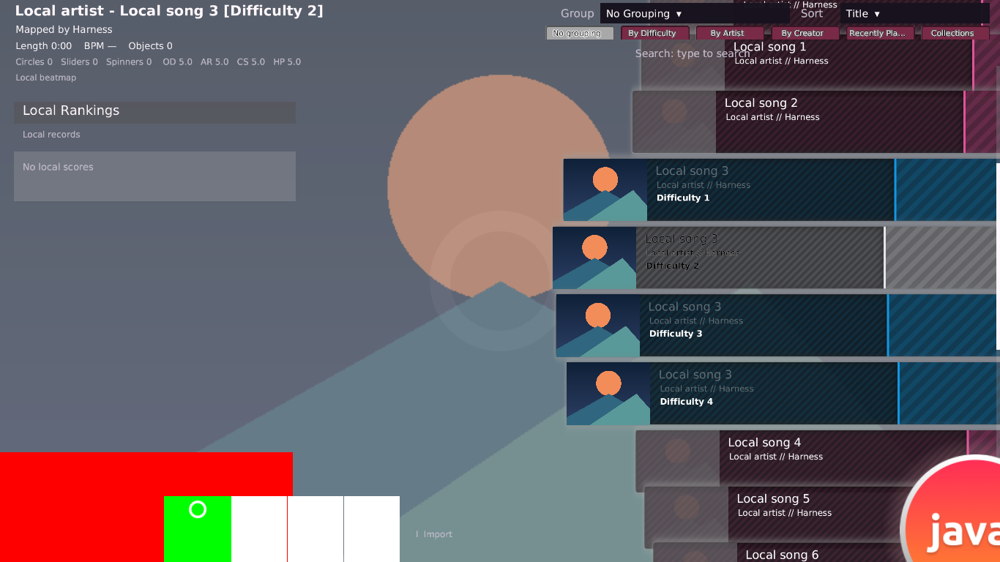
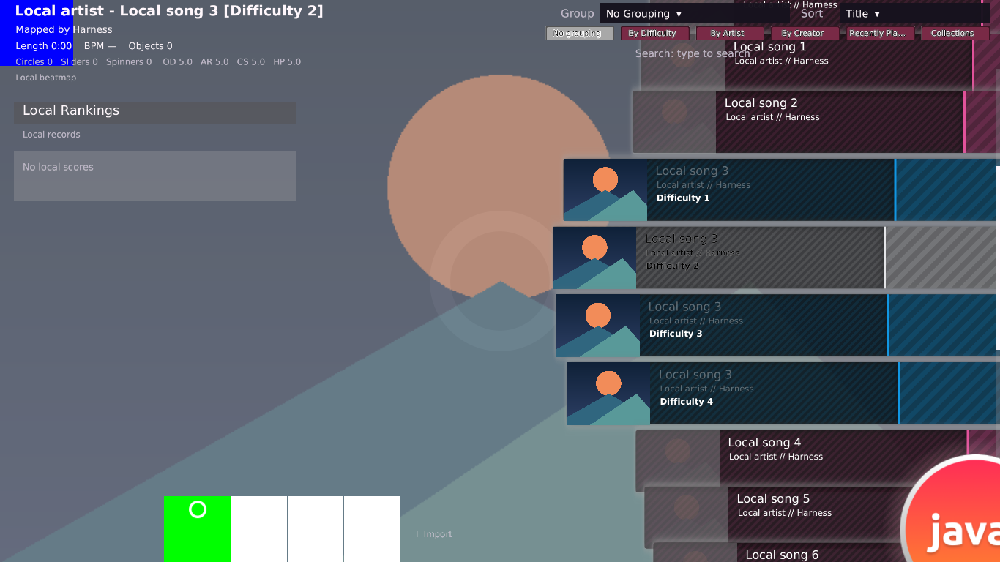
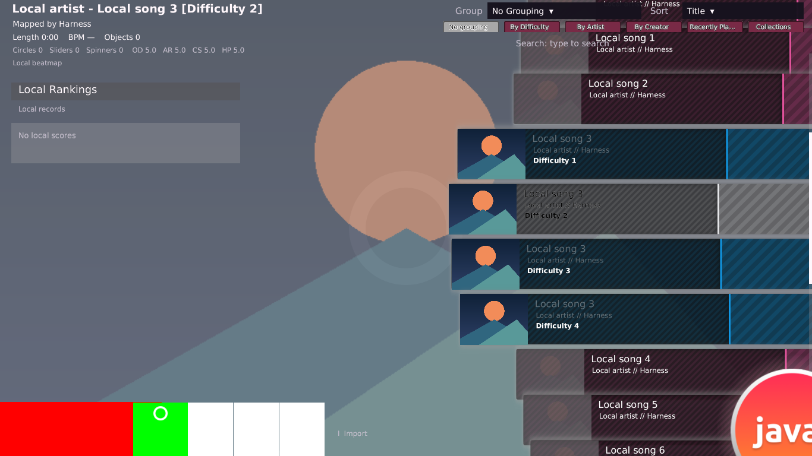

# Song Select 実装1〜6の進捗（2026-10-02）

## 今回の成果と判定範囲

ユーザー指定の1〜6を進め、難易度単位のSort/Group、Skin画像の寸法・合成・探索、
top延長、通常SelectPlayのtab、metadata内容、Backのframe更新を独立実装した。
開始commitは`2526c4d88961995d9b780fdd21fcdae947f8ac42`。
[実装計画](songselect-one-to-one-implementation-plan-20261002.md)のP0〜P9に対応する。
**1〜6全体の完了、stableの全画面との1:1合格は未認定**。確定して実装した契約と、
追加調査・ローカル機能・実機参照が必要な項目を分けて記録する。

参照binaryは`/home/coder/workspace/b20230727.9/osu!.exe`、SHA-256は
`bfa4ad675cdcd773b7b1c899e0a5e193d05d055d93e001271f06756c8185a28a`。
[IL tool](../tools/stable_results_inspect.py)、dnfile 0.18.0／dncil 1.0.2による静的調査。
公式asset抽出、暗号化文字列の復号、保護回避、production service接続は行っていない。
Quotaの懸念からWine／stable起動は行わず、画像検証にはJavaと自作素材だけを使用した。

| 指定された段階 | 実装・調査した範囲 | 残る範囲 |
| --- | --- | --- |
| 1: 比較fixture / P0 | 既存harnessへ5種のSkin、幅境界、高density、入力・状態・geometry・素材寸法の記録、fixture SHA-256を追加 | native capture、fontの物理family・DPI固定、全入力列・全frameの比較は未実施 |
| 2: Sort/Group / P1 | 難易度別の最大BPM・Library終端整数秒・文字metadata、BPM/Length境界、複数Group所属、代表行のactivateを修正 | native culture/tie-break、family identity、近い難易度の選択、残検索field |
| 3: Back・寸法・探索 / P2/P3 | Back→selection、奇数HDの整数寸法とUV crop、余分な白矩形／Options暗色化を除去。静的画像は存在ファイルのdecode失敗で探索停止 | HD eligibility、Back連番のprovider選択、provider mask/INI owner/音alias、Cookieとの全manager順 |
| 4: chrome・tab・metadata・score / P4/P5 | topの1366幅gate・1365列crop、SelectPlayの5/6 tabとカテゴリ、Artist/CreatorのSort連動、選択難易度のtitle/byline内容 | chrome予約高、tabの配置・animation、metadata typography、score/scrollbar配置・hit |
| 5: hit・入力・animation / P6 | Backの初回update epoch、Singleのframe interval、texture交換前のgeometry更新と次updateへの反映、draw/crop/hit共有寸法を修正 | 最終sprite dispatcher、alpha/clip/優先順、focus/画面境界の入力寿命、native時計との継続性 |
| 6: 文字・残機能・音声・背景・遷移 / P7/P8/P9 | GDIとAWTの測定経路、ローカル機能依存、previewの現在の寿命・seek処理を調査。V15の表示内容修正は先行 | 同じ許可fontによる測定、残Browser/selector/score/replay/collection/editor、preview/fade/loop/背景/遷移のnative全契約 |

## 閉じた契約と設計判断

### 難易度単位の分類と表示

`06003288/3282`は難易度レコードをSort/Groupへ渡す。
`06003c95`の最大BPMは検索用の主なBPMとは別で、初期最小beat lengthは5000、空のtimingは0。
`060013ff`のLength比較はLibrary終端の整数秒であり、最初のobjectからのspanではない。
Javaでは検索に合う難易度を先に並べ、そこからSet表示をprojectionする。
Artist/Creator/TitleもSetの要約ではなく各難易度のmetadataを使う。
詳細titleと行title/bylineも代表・選択難易度のmetadataに揃えた。

`060032b2/329d`のBPM Groupは[0,60)、[60,120)、[120,180)、[180,240)、[240,300)、>300。
**ちょうど300はどのpredicateにも入らない**ため、BPM Groupでのみ除外する。
Lengthは`060032b0/329b/329c`の1/2/3/4/5/10分境界を使い、負の終端はLength Groupで除外。
NONEへ戻すと再び選べる。表示件数・selection修復を回帰テストした。

同じSetの難易度が別Groupへ所属でき、代表行のactivateでそのGroupの難易度を選ぶ。
`06003257`に従い、非連続レコードとGroup境界でfamilyを分ける。
familyそのものの同一性はまだlocal Set近似で、nativeの文字列identityや評価値による
優先難易度を完成扱いにしない。cultureと同値の最終順も従来のローカルtie-breakが残る。

### Skinの合成・寸法・探索

`06003a15/0136e`、manager登録・forward render・float比較の`06002c13/2c15/2c1d/454a`から、
main manager内のBack .9/.91がselection .95/.96より先に描かれることを確認した。
JavaのBack二層をselection前へ移し、赤い巨大Backと緑のModeの交差画素を検証した。
Cookie等の別managerの全順序はこの確認へ含めない。

`060040af`のdensity除算は整数。Song Select内の`SkinTexture`だけを切り捨てに変更し、
共有`AssetFile.logicalSize()`のGameplay/Results契約は維持した。
`060040b1`のcrop→physical UVに揃え、奇数HDの端1pixelを引き伸ばさない。
185×181は92×90、545×183は272×91。論理0寸法を描画しない。
Options normal画像のRGBを白に保ち、bundled行の白い補助矩形を除いた。
通常画面のlocal/debug案内は`-Dosujava.debugUi=true`でのみ表示する。
Import、未対応操作後の案内、生成Cookie等のJava固有部分は残る。

`06001b71`の静的画像探索は、最初に存在したファイルがdecode失敗するとそこで終了する。
Song Selectの静的画像と同provider cursor-middleだけへ適用し、
Gameplay/Resultsの既存successful-load fallbackとBack連番の探索は分けた。
missingの場合のfallback、安全な失敗処理、disposeの回帰を確認した。

HD選択の`06002340`は `(displayHeight>=800 OR option04000d19) AND !option04000d26 AND maxTexture04001851>2048`。
`06002589`はGL最大texture sizeを取得し、`060016af`では両booleanのdefaultはfalse。
optionの正式名称とJava設定への対応は未確定で、Javaの常時HD優先はまだ残る。
**高さ768の奇数HD fixtureは、HDが選択された後の寸法契約を試すもの**である。
そのままdefault設定のnativeもHDを選ぶという主張ではない。

### topと通常Playのtab

`0600136e`のtop延長はdisplay width>1366でだけ生成し、logical X1365の1列をcropする。
cropからUVへの変換、window位置とUI scaleを既存Renderer内で明示した。
同depthの登録では`BinarySearch`で見つかった位置にinsertするため、延長をoriginal topより先に描く。
短い100×90 topの最終列を全画面へ延長するJavaの挙動を除いた。
透明度による予約高さや40%/30%上限は未確定なので今回変更していない。

初回台帳のtab数4/5はglobal状態名を閉じる前の分岐比較だった。
今回、**平文metadataのenum定数**を読む`--enum-values`を追加し、通常Playの分岐を確定した。
`02000b03 osu.OsuModes`のSelectEdit=4、SelectPlay=5、SelectMulti=13。
`040016f6`はこのenumで、constructorの`04000ac3/ac2`は5/13との比較。
従って通常SelectPlayは5個、横長条件成立時は6個。editor側は別の4/5分岐。
幅条件は`06001dc9`の `ceil(displayWidth/(displayHeight/480f))>720`。

| tab登録値 / localization ID | 平文OsuStringの識別子 | Javaの対応 |
| --- | --- | --- |
| 12 / 751 | SongSelection_NoGrouping | Group.NONE、Sort維持 |
| 5 / 756 | SongSelection_ByDifficulty | 未対応案内。別Groupへ誤対応しない |
| 1 / 752 | SongSelection_ByArtist | Group.ARTIST + Sort.ARTIST |
| 3 / 754 | SongSelection_ByCreator | Group.CREATOR + Sort.CREATOR |
| 14 / 767 | SongSelection_RecentlyPlayed | 未対応案内。選択・分類を変更しない |
| 18 / 762 | SongSelection_Collections | 幅条件成立時のみ。未対応案内 |

識別子は`02000b0a osu_common.Helpers.OsuString`の宣言定数から読んだ。
カテゴリの説明は[公式wikiのGroup and Sort](https://osu.ppy.sh/wiki/en/Client/Interface#group-and-sort)も参照。
localized表示文字列そのものの一致は未認定。
`0600138a→1384`によるArtist/CreatorのSort連動を反映した。
BPM/Lengthは現ローカルGroup dropdownで引き続き利用できるが、そのdropdown全内容はnative未対応。

| display W×H | native論理幅 | SelectPlay tab数 / Java修正後 |
| --- | --- | --- |
| 1024×768 | 640 | 5 / 5 |
| 1280×900 | 683 | 5 / 5 |
| 1152×768 | 720 | 5 / 5 |
| 1153×768 | 721 | 6 / 6 |
| 1366×768 | 854 | 6 / 6 |

### Backの初回epochと異寸法連番

`06001b1a`は初回updateをepochにし、`06001b1b`はSingle除算したintervalをDoubleへ保存する。
fps省略時はframe数をfpsにする。3枚の場合の1000msはまだframe2、1001msでwrapする。
Javaでは小さなBack専用stateを追加し、GameplayのGameClockから独立させた。

`06001b19`はbase geometry更新後に`06001b1a`でtextureを交換する。
新textureの寸法が反映されるのは次updateであり、この**1 update遅れを保持**した。
初回80×50 SDから140×90 logical HDへ交換すると、そのupdateは80×50のcropを使う。
次updateでdrawとhit寸法を140×90へ揃える。dimension抑止flag`04001204`は
`06002515/27d9`が書込み元で、Back constructorには設定がないことを確認した。
normal/overの時計の全寿命、minimize/focus/global時計との継続性、最終hit dispatcherは未確定。

### 段階6の調査結果

文字の`0600306d/3074`はGraphics.FromHwnd、DPI変換、Graphics.MeasureString/SizeF/StringFormatを使う。
Javaの`SmoothUiFont`はAWT logical SansSerif、2倍oversample、独自のfit幅／baseline／descent。
同じ許可fontのnative計測結果がなく、差の原因を分離できないため、font名やbackendを推測で交換しない。
metadataの内容修正と、文字pixel・配置の未対応を分けた。

ローカル機能を確認した結果、通常Modsはactive空／toggle=false、AutoはDEBUG_ONLY、
Optionsは案内のみ。他ModeのSong Select表示とGameplay実装は別の依存である。
scoreの64高/68pitchと独自column幅、replay/collection/editor等の不足はV17/V21/D03へ残す。
未対応tabを既存Group ordinalへ結びつける誤動作は修正したが、機能完了にはしていない。

`SongSelectPreview`は同path変更を無視し、新pathでdispose→loop→play→正のPreviewTime seek。
未指定は0、clockはMusic.getPosition。対象nativeの同path別難易度、省略時seek、fade/loop、
ロード逆転／失敗／復帰はまだ閉じていない。平文PreviewTime定数の所在も確認したが、
Osz2MapMetaTypeの定数から再生時刻契約を推定せず、T01/T02の製品処理は変更していない。

## Javaの画像・検証

以下は自作素材による**修正後Java画像**。native screenshot／pixel goldenではない。



左下の赤いBackの上に緑のModeが描かれ、白いOptionsを独自に暗くしない。



100×90の青いtopは左上だけに描かれ、右側全体へ青い最終列を引き伸ばさない。



ModeのHD画像の末端に置いた青いsentinel列／行を整数logical寸法の外へcropする。

fixtureはVersion 2.2、AnimationFramerate 2、active文字黒／inactive文字白。
top/bottom/Back/cursor/trail/middle/star2は1×1透明、Mode normalは92×90緑、
その他selection normalは76×90白、overは1×1透明を基本とする。
overlapは400×150赤Back、odd-hdは185×181 Mode HD＋545×183 Back HD、
short-topは100×90青top、animated-backは80×50赤SD＋280×180青HDの左上160×100赤。
未置換の行背景などはrepository bundled素材を使い、その選択pathもscene reportに記録する。

最終buildでcore **125 suites / 1,227 tests**、desktop **2 suites / 4 tests**、failure/error/skip 0。
product修正後のbuildではcore/desktop testを実行した。
最後のharness記録変更のbuildはharness compilationを実行し、既存testはUP-TO-DATE。

- `parity-visual`: **30 scenes / 30 PNG**、画素assertion、異寸法Backの更新・crop・draw/hit、navigation/disposal成功。
- `browser-contracts`: **28 scenes / 28 PNG / 112 scripted transition frames**、分類・検索・Group・navigation/disposal成功。
- decode失敗の個別`phase5a-assets-malformed`: **1 scene / 1 PNG**成功。静的画像／共有resolverのunit回帰も成功。
- `parity-visual`の画面は1365/1366/1367×768、1152/1153×768、1280×720 framebuffer density 2。
- 境界値・文字metadata・代表行は`SongBrowserClassificationTest`、Back時刻は`SongSelectBackAnimationTest`、tab構成／連動は`SongSelectVisualComponentsTest`等で検証。

```sh
./gradlew build --offline --console=plain
xvfb-run -a ./gradlew :lwjgl3:songSelectVisualHarness --offline --console=plain \
  -PsongSelectPhase=parity-visual -PsongSelectOutput=/tmp/osujava-parity-completed-20261002
xvfb-run -a ./gradlew :lwjgl3:songSelectVisualHarness --offline --console=plain \
  -PsongSelectPhase=browser-contracts -PsongSelectOutput=/tmp/osujava-parity-browser-final-20261002
```

PNGと同scene IDの`.txt`にwindow/framebuffer条件、locale、Java、font経路、時刻、入力、
path/provider/density/physical/logical寸法、query/sort/group、selection/focus、tab数、
Back draw/hit、selection normal/over/hit、行geometryを保存する。
`parity-fixtures.sha256`は自作5 SkinのPNG/INI計84ファイルのhash。出力全84件を再計算し一致を確認した。
再実行は同じcommitを使い、native比較時はfont・HD条件・locale等も一致させる必要がある。

最終ログは`/tmp/osujava-parity-tab-categories-build-20261002.log`、
`/tmp/osujava-parity-final-build-20261002.log`、`/tmp/osujava-parity-completed-capture-20261002.log`、
`/tmp/osujava-parity-browser-final-capture-20261002.log`。
一時資料は`/tmp/osujava-parity-{p3-p5-p6,texture-tabs,back-update-refs,native-enums,resolution-context,families,representatives}-20261002.{il,txt}`等。
消失後は上記binary hashと主要token、入力条件、repositoryのtool/harnessから再調査・再生成できる。

```sh
/path/to/dnfile-dncil-venv/bin/python tools/stable_results_inspect.py /path/to/osu\!.exe \
  --enum-values 02000b03 02000b0a
```

このCLIは宣言されたInt32定数のみを読み、resource／暗号化文字列を解決しない。
正しい2 enumの値とhashを確認し、非enum `02000001`はexit 2の明示エラーを確認した。

## 1:1までに残る差

[比較台帳](songselect-one-to-one-gap-ledger-20261002.md)の全33 IDを維持する。
V01/V02/V03/V05/V06/V08/V09/V11/V14/V15/V22/D01/D02/D05は今回の対応を記録した。
V01のCookie/manager順、V02の全部品hit、V08/V09の全時計寿命、V11のBack探索等は残差がある。
V04/V07/V10/V12/V13/V16〜V21、D03/D04、I01〜I04、T01/T02は既存の部分対応・未確定・
機能依存を引き継ぐ。修正した一部条件だけでID全体を完了扱いにしない。

| ID | 現在の実装・残差 |
| --- | --- |
| V01 | Back→selection対応済み。Cookieと全manager順は残る |
| V02 | 整数logical寸法・UV crop対応済み。全部品の最終hit比較は残る |
| V03 | top延長gate・crop対応済み。native実画素照合は未実施 |
| V04 | chromeのalpha予約・上限・最小高が残る |
| V05 | Options normalの暗色化を除去。全hover/press比較は残る |
| V06 | 行の白い補助矩形を除去。全色合成の実機照合は残る |
| V07 | alpha union・固定slotとnative dispatcherとの差が残る |
| V08 | Back異寸法の更新順を対応。全寿命・最終hitは残る |
| V09 | Back epoch・Single interval対応。global時計の継続性は残る |
| V10 | HD eligibilityのJava設定対応が未確定 |
| V11 | 静的画像decode失敗で停止。Back連番探索が残る |
| V12 | provider mask・RawName例外・INI ownerが残る |
| V13 | 既存INI部分対応を維持。追加parser/音alias比較が残る |
| V14 | 通常Playのtab identity/数/Sort連動対応。配置・機能が残る |
| V15 | 難易度metadata内容対応。文字位置・サイズ・影が残る |
| V16 | 同じ許可fontのnative測定・pixel照合が必要 |
| V17 | score配置・clip・機能依存が残る |
| V18 | carousel/score各scrollbarのgeometry・drag比較が残る |
| V19 | Cookieの生成素材・拍・hover・hitの差が残る |
| V20 | 背景・粒子・拍・入退場の契約が未確定 |
| V21 | Mode/Mods/Options selector外観と実機能が残る |
| V22 | 通常debug案内を除去。Import等のローカル固有表示が残る |
| D01 | 難易度別分類対応。culture/tie-breakが残る |
| D02 | 数値Group境界対応。native実機照合は未実施 |
| D03 | 残検索field・ローカルデータ／Ruleset依存が残る |
| D04 | 検索待機・Regex/IME/culture境界が残る |
| D05 | 複数Group・代表activate対応。family identity／優先難易度が残る |
| I01 | 既存行animation対応を維持。全frame実機照合は未実施 |
| I02 | hit候補順・alpha/clip/丸めが未確定 |
| I03 | 初回key/wheel/mouseの同frame更新順が残る |
| I04 | focus/画面境界での入力状態の寿命が残る |
| T01 | 同path・seek/fade/loop/clockの全契約が未確定 |
| T02 | 非同期結果・入退場・Gameplay復帰の契約が残る |

次の小単位はHD設定・provider/連番探索の対応表、chrome/scoreのmanager clipと座標、
dispatcherの候補順・入力寿命、同じ許可fontの測定、preview/復帰契約の順で閉じる。
独立した確定差が見つかれば、該当部分の回帰・capture・build・commitを先に進める。
正常なオフラインstable参照は総合pixel/audio合格の前提であり、Java capture成功で代替しない。

## commit一覧

実装・調査ツール・fixtureは論理単位でcommitし、各製品修正後のbuildと関連回帰を確認した。
`b1e32ea`の幅thresholdは維持し、そこで未確定だった4/5の画面分岐は`2dd1f82`で通常Playの5/6へ訂正した。

| SHA | message |
| --- | --- |
| `03aa4bd2b1591c42bcb4de4a0afe3f5c4a9e43e8` | test: add reproducible Song Select visual parity fixtures |
| `6f1fd4e0856dbfa91fa3ab28521b74776b6ab6ab` | fix: classify Song Select rows by matching difficulty statistics |
| `316e6184ed0a81003e7702575f5bceadd66f05ca` | fix: draw Song Select Back beneath selection artwork |
| `7ae09f60dbd36d546b0abed2c0b9cfa1d7a69436` | fix: truncate Song Select HD texture dimensions |
| `93377d3ca86529dfb3e58123c985a8d0f540a0ab` | fix: activate the clicked Song Select group representative |
| `90ad03ece1cdbae1e2926d017be37d740e5f211f` | fix: preserve Song Select artwork colours without contrast overlays |
| `188a1890c7d3cb1f2be141a1efad46ef06d31b1c` | fix: crop odd HD pixels in Song Select sprite sampling |
| `8baf7fdb472109ccc6e9237bc96406f9a86d6cc2` | fix: match Song Select top extension gate and crop geometry |
| `80496b9223b92e93e302692cacee8ade44fe320b` | fix: stop Song Select static image lookup after decode failure |
| `0aedf3c2e503c5fbbe96af174aeb4077abf03a38` | fix: preserve native Song Select numeric group exclusion boundaries |
| `b1e32ea24f1a3e5f3bac8d7052a169c821ef88e0` | fix: use native Song Select tab width threshold |
| `7f70b5774fe49524bd9a3df32227972710cbe55a` | fix: track Song Select Back sprite epoch and frame geometry |
| `6a74019b95f28d512116a715d569122d4e73ab79` | fix: sort Song Select text fields by difficulty metadata |
| `354d08ddd9998908abad52bc88626906f7a60cea` | fix: show Song Select titles from the selected difficulty |
| `2dd1f82bd41ae0fc05188f77cc743f0ebb177c6e` | fix: match Song Select Play tab identities and sort coupling |
| `cf07afbedf7b997f3995529b5af8cff432312e61` | tools: inspect declared stable enum constants without resource decoding |
| `417fc9cd449a8c976a732b09aa77f51682a4e6d4` | test: record Song Select parity fixture hashes and capture environment |
