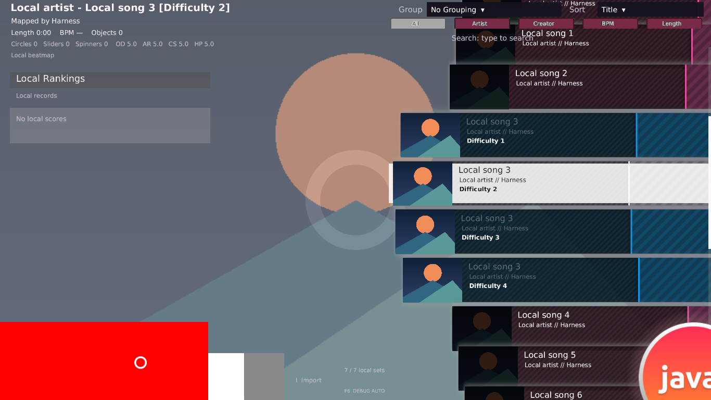
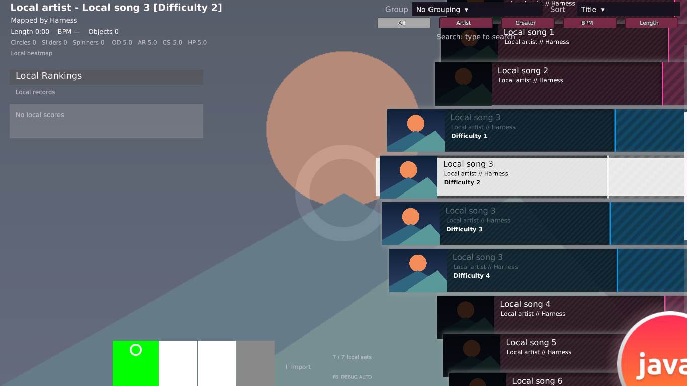
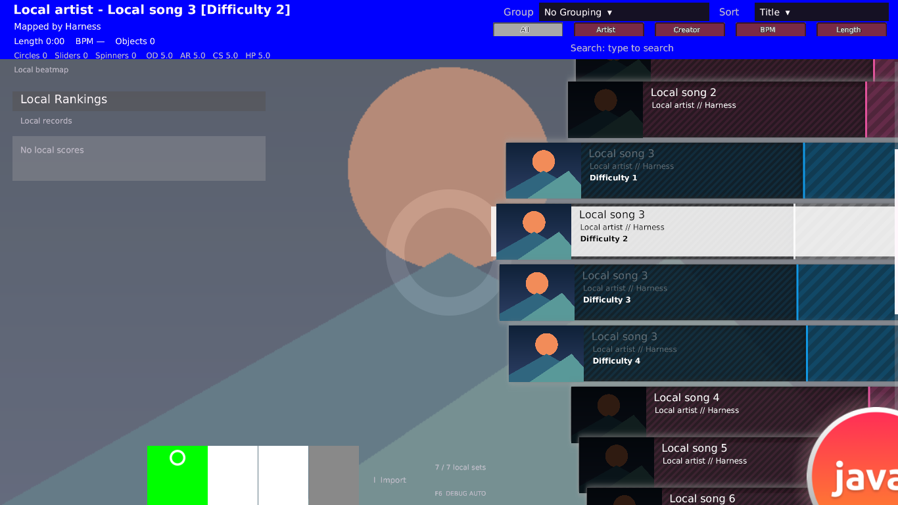

# Song Select: Skinとビジュアルの再調査（2026-10-02）

追補: 本書のJava画像・差分は調査時のcommitに対応する。ユーザー指定1〜6による修正後の画像、
契約・検証・commit・残差は[1〜6の実装進捗](songselect-parity-implementation-progress-20261002.md)を参照。

## 結論

現在のSong Selectは、素材の独立探索、行の状態色、10枠の星、foregroundの時間変化には対応している。
残る視覚差は単なる画像の不足ではなく、**HD選択条件、論理寸法、画面全体の合成順、透明部分から推測する配置・操作領域**にある。
今回新たに強く確認できた差は、Backとselectionの描画順、奇数寸法HDの扱い、top延長の条件。
Optionsの暗色化、bundled行背景への白い補助矩形もJava独自の見た目として区別する。

今回は調査のみ。製品コード・既存テストの期待値・参照binaryは変更していない。
この文書とJavaの再現画像だけを追加する。Sort／Group、Gameplayの改修は対象外。

## 対象と証拠の区別

- Java基準: `288187876fb2613e61f1ce3b38d05611075c84cb`。開始時working treeはclean。
- stable: `/home/coder/workspace/b20230727.9/osu!.exe`。
- SHA-256: `bfa4ad675cdcd773b7b1c899e0a5e193d05d055d93e001271f06756c8185a28a`。
- [read-only IL tool](../tools/stable_results_inspect.py)を`dnfile 0.18.0`／`dncil 1.0.2`で実行。
  以下のtokenとoffsetはこのexe専用。暗号化文字列を復号せず、同一resource IDと参照関係を利用した。
- **IL確認**は静的な分岐・計算・登録順の確認。**Java観測**は実際のJava計算／PNG decode／OpenGL capture。
  **差の予測**は両者の比較から得るもの。stable実機のpixelを観測したという意味ではない。
- この環境でstableの正常Song Select参照実行は未確保。今回もnative screenshot/audio比較はない。
- ユーザーのQuota懸念を踏まえ、Wine等による起動検証は今回行わず、追加起動試行もしない。
- 完全ローカル。公式asset抽出、保護回避、クライアント改変、production service接続は行っていない。

過去の[Skin独立調査](skin-stable-independent-audit-20260929.md)は旧commit時点の比較。
その全項目を未修正として数えず、[phase 1](songselect-parity-phase1-20260929.md)、
[星方式](skin-stable-star-style-audit-20260929.md)、[phase 9 composition](songselect-parity-phase9-composition-20260929.md)
と現在のコードで修正済み範囲を確認した。

## 1. 素材選択と設定

| 対象 | stableのIL契約 | Javaの現状と視覚的影響 |
| --- | --- | --- |
| HD eligibility | `06002340`は`(04001396 >= 800 OR option 04000d19) AND NOT option 04000d26 AND capability 04001851 > 2048`。`06001b71`がこの条件を使う | `SkinAssetResolver.resolveIn()`は常にHD→SD。両画像の絵が異なるSkinでは、同じ名前でも選ぶ絵が異なり得る。optionの正式名・全設定元は未確定で、800をJava window heightへ直結しない |
| missingとdecode failure | `06001b71` `020d–0282`では、存在するHDを読み込んだ結果がnullでもその経路から戻る。SD不存在とHD読込失敗は同じではない | loaderが失敗するとSD／別providerへ進む。壊れたHD＋正常SDはJava側で代替絵になる。安全にエラーを扱う設計と、nativeと同じ素材選択かの判定を分ける |
| provider mask | `06001b71`には4→2→1の候補とglobalによるbit 4除外がある。Backは`06003a15`でmask 3 | JavaのCUSTOM→FALLBACK→BUNDLEDに汎用maskはない。FALLBACKは任意の別ローカルSkinであり、stableの譜面providerではない。Song Selectでbit 4が実際に有効になる条件は未確定 |
| 新旧anchor | `0600136e` `0803–0843`: `06002ac8()`またはMods normalのprovider=1で新式 | 通常VersionとBUNDLED Modsの分岐は対応済み。`06002ac8`のglobal `0400171d`・特別RawName分岐は未対応。通常Version 1の全ケースが旧式というわけではない |
| component間の探索 | selection normal/over、top/bottomは個別探索。middleはcursorのproviderに限定、trailは独立 | 対応済み。normalがあるからfallback hoverを抑える旧仕様、authoredSurfaceによるchrome抑制は残っていない |
| 設定ownerとINI | 通常INIのcase・重複・boolean・RGBA契約と、画像providerは別軸 | case区別、最初のキー保持、boolean、RGBA、CursorTrailRotate省略falseは対応済み。重複section・読込失敗・特殊Skin・cursor設定ownerの全分岐は未確定／未対応 |

実装: [SkinAssetResolver](../core/src/main/java/dev/osujava/skin/SkinAssetResolver.java)、
[SongSelectSkinAssets](../core/src/main/java/dev/osujava/skin/SongSelectSkinAssets.java)。
透明の正常PNGはmissingと区別され、custom 1×1透明画像もJavaで保持される。
ただし、保持されることと、同じhover/click範囲になることは別の契約。

## 2. 寸法と配置

### HDの奇数寸法は一律に一致しない

`06000739/073a`は元寸法をdensity divisor `0400033c`で整数除算し、
`060040bb`がその値をsprite寸法`04002855/2854`、crop寸法`04002851/2850`へ保存する。
`060040a7` constructorも`060040bb`を呼ぶ。

Javaの`AssetFile.logicalSize()`と`SkinTexture.logicalWidth/Height()`はfloat除算。
星と行内mode／gradeは描画時に整数化済みだが、selection、Back、top/bottom、行背景の一般geometryはfloatのまま。
**「星の奇数HD対応済み」をSkin全画像の対応済みへ拡張できない。**

GL不要の一時Java probeで、1366×768を直接layoutへ渡した結果:

| 自作入力 | Javaの表示寸法 | stableのsprite論理寸法取得 |
| --- | --- | --- |
| selection-mode@2x:185×181 | 92.5×90.5 | 92×90 |
| menu-back@2x:545×183 | 272.5×91.5 | 272×91 |

最終pixelへの影響はscale・origin・丸め・filterに依存する。上表は取得寸法の比較であり、
あらゆる最終画素に常に0.5pxのずれが生じると断定するものではない。
実PNGによる`odd-hd` captureでもdensity 2の選択を確認した。

### topの延長は「画像の右端」一般ではない

`0600136e` `1b85–1c2c`:

- `04001395 <= 1366`なら追加の延長spriteを作らない。
- 延長spriteの位置は`1365 / displayScale`、crop X=1365、crop width=1。
- X scaleは`04001395 - 1365`。
- `06001dc9/1dcb`でもdisplay width/heightと480基準scaleの関係を確認した。

Javaの`drawTopSkin()`は画像がviewport幅より短ければ、**任意のwidthで、そのtextureの最終物理列**を延長する。
条件と参照する列の両方が異なる。custom topが幅100のfixtureは、その差を大きく可視化できる。
HDのcrop座標から最終UVまでの全変換は今回閉じていないため、1365をJava textureの物理Xへ直接移植しない。

また、Javaにはalpha>=16のtop-depth scan、top40%／bottom30%の予約上限、最低予約高さが残る。
自作probeで高さ768・opaque top600・bottom400を与えると、top予約307.2、bottom予約230.4となった。
これらはJavaの配置方針であり、nativeのsprite矩形・depthだけから導ける互換仕様ではない。

## 3. 合成順と色

### Backがselectionを覆う差を再現

`06003a15` `0073–019d`は同じBack texture配列からdepth .9／.91の2枚を作る。
`0600136e` `149f–14b0`は通常のSong Selectでそのリストをmain manager `04000ad6`へ登録する。
selection normal／overも同managerへ、depth .95／.96で登録される。
`06002c13`のBinarySearch挿入、`06002c15`のsort、`0600454a`のSingle.CompareTo、
`06002c1d` `046b–057a`の先頭からの描画loopを照合した。
managerのcomparer field `04001bda`もsignature `06 12 a5 28`からTypeDef `0200094a`（`0600454a`のowner）と確認した。
**通常constructor経路ではBackがselectionより先に描かれる。**

Javaはselection全normal→全hover→Cookie→Back二層の順で描く。
Backの二層描画自体は存在しており、「Backが一層しかない」という未実装項目にはしない。
問題は画面全体での位置づけと、時間・寸法・操作の細部。

自作Skinを使い、1366×768／density 1／時刻1秒／harnessのhover指定(700,350)で比較:

| 点（window pixel、左下原点） | 赤いBack400×150あり | Backを1×1透明へ交換 |
| --- | --- | --- |
| (260,40): Mode領域 | RGBA(255,0,0,255) | RGBA(0,255,0,255) |
| (350,40): Mods領域 | RGBA(255,0,0,255) | RGBA(255,255,255,255) |

JavaでBackが覆うことを実画素で確認した。nativeでは後段のselectionが上に重なるという予測はILに基づく。
native captureを取得した結果ではない。





### Optionsとbundled行背景にJava独自の補正がある

- `SongSelectRenderer.selectionEnabled()`はOptionsを常にfalseにし、`drawSelection()`はRGBを.54倍する。
  白い自作Optionsの内部点(490,40)はRGBA(137,137,137,255)となった。
  stable constructorの対応normal／overはWhiteで生成される。nativeの後続全状態を読んだ主張ではないが、
  Javaの「機能未提供を理由に必ず暗くする」経路は明確な独自表示である。
- `SongSelectRowRenderer.fallbackWash()`はbundled画像＋暗いactive text＋選択／開Groupの場合、
  背景spriteの後にalpha .86の白い矩形を追加する。これは通常の状態RGBAを適用するだけの処理ではない。
  custom画像には実行されないため、同じINI色でもprovider変更で行の見え方が変わる。
- MainMenuLogo、中央粒子14個、cos^4の拍波形、generated mode glyph、星fallback、
  thumbnail欠損時の矩形、Import／local sets／F6 labelはJavaの代替素材・独自UI。
  同じSkinを指定したというだけで、これらの領域をpixel一致と認定しない。



画像内の診断ボタン・青top・赤Back・背景譜面fixtureは自作。
行背景等は同梱Greylooks 1.4（iZaIxSP、CC BY 4.0）を利用する。
素材出典・ライセンスは[THIRD_PARTY_ASSETS](../THIRD_PARTY_ASSETS.md)を参照。stableから抽出した画像は含まない。

## 4. 透明部分とhover表示

nativeの`060040af` `0db8–0e84`はorigin、位置、絶対scale、sprite幅高さから矩形`04002860`を作る。
この矩形生成箇所にPNG alpha scanはない。条件付きMath.Roundも存在する。
selectionではhover側にinteractionとcallbackが付く。

Javaは`SelectionAssetBounds.detect()`でalpha>=160の領域を採用し、そこが空なら>=16を採用する。
`SongSelectToolboxLayout`でnormal／hoverのcontentをunionし、固定slotへclipする。
Backも初回画像のalpha領域を固定Back slotへclipする。

| Java probe入力 | Java結果 | 視覚上の意味 |
| --- | --- | --- |
| 全pixel alpha 0／15 | interaction content空 | 薄く見える画像でもhoverを開始しないことがある |
| 全pixel alpha 16／159／160／255 | 92×90のcontent | alpha値が閾値を跨ぐと操作領域が変わる |
| normal1×1透明、hover600×350不透明 | 描画600×350、interaction92×90 | (350,100)はhover画像内でもinteraction外。大きな装飾を固定slotへ制限する |

nativeの最小hit範囲、透明時のcallback、重なったhover候補の優先を今回全確定したわけではない。
したがって「nativeは透明全域を必ずclickできる」とは断定しない。
確定した差は、Javaがalphaとnormal/hoverのunionを操作geometryへ持ち込んでいる点。
それがhover画像・加算Back・tooltipの見え方にも影響する。

巨大compositeを画像寸法で判定してImport／status／debugを上へ移す処理もJava独自。
Skin作者の絵とは別に追加labelが動くため、通常画面の比較と診断UIを区別する必要がある。

## 5. 時間変化とフォント

| 部品 | 現状 | 残る比較 |
| --- | --- | --- |
| selection hover | `0600136e`の.01→1、100msに対応するJavaモデルあり | nativeのhover候補・alpha条件・frame開始時刻・中断の厳密一致 |
| Back hover | 二層、加算overlay、1/255→.4、250msのモデルあり | Java初期値は.01。normal/hoverのdepth、hit、開始時刻、native Backの別構築経路 |
| Back animation | 同providerの連番、正fpsと省略時1秒loopの基本契約に対応 | native `06001b1a`はsprite clock／初回更新からepochを確定。JavaはScreen elapsedを直接sample。画面往復・停止・入場transformとの関係は未検証 |
| Back frame寸法 | Javaの描画は現在frame寸法を使用する | hit metricsは先頭frameのまま。native `06001b1a` `013c–01bd`はframe変更時にtextureを交換し、通常分岐で`060040bb`を呼び寸法も更新する。全dispatcherの最終hitは未検証 |
| 星／行色／foreground | 500ms scale/crop、80ms順序、色遷移、detail300ms、base200ms、thumbnailの1000ms／読込後400ms等は対応済み | native実機での時刻・画素比較。星方式はstar自身ではなく行背景provider＋Versionで決まる |
| cursor/trail/middle | provider結合とINI既定値は対応済み。共有lazer由来visualを使用 | stableの設定owner、global scale、入力密度、new/old trail、初回epoch。共有visualがあるだけでstable一致とはしない |
| 文字 | title/byline/detailの公称16/12/12、中央左origin等は対応済み | stableのGDI測定／描画とJava AWT SansSerifの字幅、baseline、ellipsis、Unicode fallback、DPI・filter・影 |

Back frame更新の寸法抑制flag `04001204`もxrefを確認した。
書込元は`06002515/27d9`で、`06003a15` constructorには設定がない。
ただし全画面境界での変更を網羅したものではなく、frame寸法とhitは実機fixtureでも確認する。

## 6. 修正の優先順位と設計判断

1. **画面全体の重なり:** Back .9/.91、selection .95/.96、top/bottom .7、metadata等の順序を同じ台帳へ置く。
   行passはBrowser順対応済みなので、そこを再実装せず、main chromeの固定passを小さく修正する候補とする。
2. **素材と寸法:** HD eligibility・decode failure・mask・整数論理寸法を別々に検証する。
   `logicalSize()`を一律に変える前に、GameplayとUIで使用する単位を確認する。
3. **top延長:** display幅、crop、density変換を閉じてから、任意画像の右端延長を置き換える。
4. **透明・hover・Back時間:** alpha scanに基づく独自判定とnativeのsprite hitを分け、
   normal/over寸法違い・全透明・Back frame寸法変更の入力列を比較する。
5. **文字・代替素材:** フォント変更は同じfontと文字fixtureの測定後に判断する。
   fallbackWashやgenerated glyph等は比較対象の素材差として明示し、maskで隠して合格にしない。

メモリ予算・危険入力防御は撤去しない。壊れたSkinを安全に扱うことと、正常Skinの絵・配置を変えることを分ける。
汎用scene graph、全Renderer交換、Gameplay改修を今回の調査だけから必須とは判断しない。

## 7. 再現・検証

関連テストは`SkinAssetResolverTest`、`SongSelect*`のSkinテスト、`SelectionAssetBoundsTest`、
ToolboxLayout／Hover／VisualComponents／RowPresentation／ReferenceGeometryを実行。
**12 suites / 164 tests、failure・error・skip 0**。

続けて`./gradlew build --offline --console=plain`成功。
15 tasks中core:testが再実行、残り14はUP-TO-DATE。
core **123 suites / 1,195 tests**は今回再実行し、failure・error・skip 0。
desktop **2 suites / 4 tests**は既存結果であり、今回はUP-TO-DATE。

- `skin-contracts`: **24 scenes / 24 PNG / 8 scripted frames**とnavigation/disposal成功。
- `selection-chrome`: **16 scenes / 16 PNG**とnavigation/disposal成功。
- 自作`overlap / no-back / odd-hd / top-edge`: **4 scenes / 4 PNG**とnavigation/disposal成功。
- 既存40画面の条件: 1280×720、1920×1080、1280×720 framebuffer 2倍、1024×768。
- 自作4画面: 1366×768、density 1、時刻1秒、harnessのhover指定(700,350)。この指定はUiLayout座標であり、window pixelとは別単位。
- `skin-contracts`の成功はJavaの実装契約の検証。alpha固定slot等の期待値にはJava独自方針があるため、native互換合格率ではない。

```sh
xvfb-run -a ./gradlew :lwjgl3:songSelectVisualHarness --offline --console=plain \
  -PsongSelectPhase=skin-contracts -PsongSelectOutput=/tmp/osujava-visual-skin-20261002-captures
xvfb-run -a ./gradlew :lwjgl3:songSelectVisualHarness --offline --console=plain \
  -PsongSelectPhase=selection-chrome -PsongSelectOutput=/tmp/osujava-visual-skin-20261002-composition
```

自作Skinの再現方法: Version 2.2、active text黒／inactive text白。
top、bottom、Back、cursor/trail/middle、star2を1×1透明PNGで置換。
selection-mode normalは92×90不透明緑、Mods／Random／Options normalは76×90不透明白、全overは1×1透明。
`overlap`ではBackを400×150不透明赤、`odd-hd`ではMode HD185×181緑／Back HD545×183赤を追加、
`top-edge`ではtopを100×90不透明青へ交換する。それ以外は`no-back`と同じ。

```sh
xvfb-run -a ./gradlew :lwjgl3:songSelectVisualHarness --offline --console=plain \
  -PsongSelectPhase=configured -PsongSelectCustomSkin=/path/to/self-authored-fixture \
  -PsongSelectWidth=1366 -PsongSelectHeight=768 -PsongSelectTime=1 \
  -PsongSelectHover=700,350 -PsongSelectOutput=/tmp/self-authored-capture
```

一時資料は`/tmp/osujava-visual-skin-{20261002,manager-20261002,depth-20261002,animation-20261002,contracts-20261002,coordinates-20261002}.il`、
animation flagのxrefは`/tmp/osujava-visual-skin-animation-xrefs-20261002.txt`。
managerの型signatureは`/tmp/osujava-visual-skin-manager-type-20261002.txt`。
Java probeは`/tmp/VisualSkinProbe.java`と`/tmp/osujava-visual-skin-probe-20261002.txt`、
PNG生成は`/tmp/osujava-visual-skin-fixtures-20261002.py`。
ログは`/tmp/osujava-visual-skin-20261002-{tests,build,harness,composition,overlap,no-back,odd-hd,top-edge}.log`。
一時ファイル消失後も比較根拠を再現できるよう、主要token、分岐、入力寸法・色・時刻、数値結果と3枚のcaptureを本書へ保存した。
